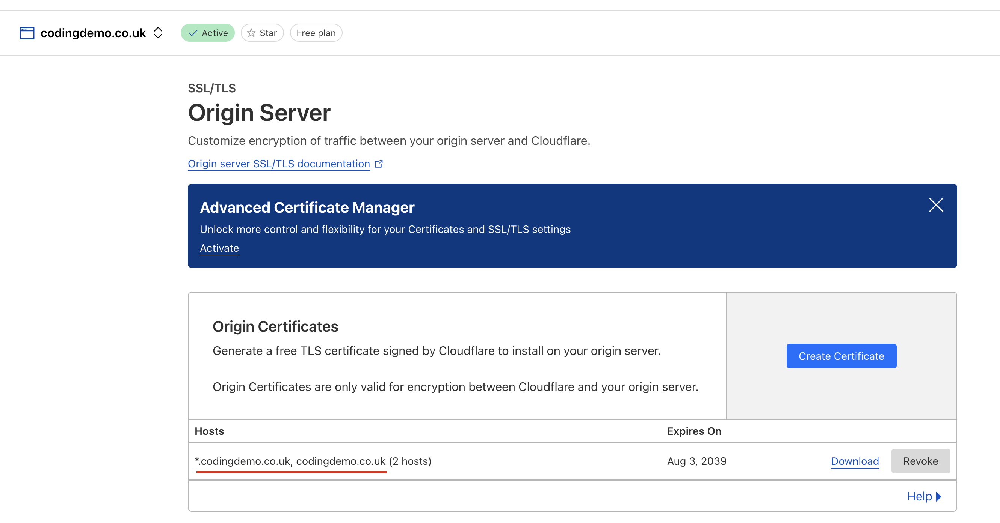

# Add a new environment

> [!IMPORTANT]
> If you are adding a new production environment, then you will need to make sure that you are making adjustments
> to script and github workflow files in a release branch

1. Create github environment:

   1. Add the new environment to [github-setup-environments.yml](../.github/workflows/github-setup-environments.yml)
   2. Go to the Actions tab in the github repo
   3. Manually run the workflow you have adjusted above: [Github create environments](https://github.com/christianacca/web-api-starter/actions/workflows/github-setup-environments.yml)

2. Add approvals and branch protection policies to github environment

   Go to [Settings > Environments](https://github.com/christianacca/web-api-starter/settings/environments) in the github repo 
   and select the environment you have just created. Add the branch protection rules as required for the new environment.

   Recommendations:
   * qa: require approval (to allow qa to pull changes into environment at their own pace, and to avoid a deploy from release branch being overwritten)
   * demo, demo-xx: require approval
   * staging, prod, and prod-xx:
      * require approval
      * only allowed to run for release branches and the default (eg master) branch

   For more information see: <https://docs.github.com/en/actions/deployment/targeting-different-environments/using-environments-for-deployment>

3. Ensure service principal used by github actions can authenticate for the new environment.

   The github actions workflow will authenticate to Azure AD using a service principal using a federated credential for the
   environment it is attempting to deploy to. Therefore, for any new environment, you need to ensure that the service principal
   has a federated credential setup for this new environment.

   If the new environment is in a difference subscription from the existing environments, then you will need to:
   1. Create a new service principal. Follow the section "Create automation service principals" as described in the repo
      [service-principal-automate](https://github.com/MRI-Software/service-principal-automate/tree/main?tab=readme-ov-file#create-automation-service-principals)
   2. Modify [set-azure-connection-variables.ps1](../.github/actions/azure-login/set-azure-connection-variables.ps1) 
      with the details of the new subscription and service principal client id
   3. Modify [cli-permissions.bicep](../tools/infrastructure/arm-templates/cli-permissions.bicep) and 
      [provision-shared-services.ps1](../tools/infrastructure/provision-shared-services.ps1) for the new service principal
   4. Follow the section [Grant RBAC management permission for shared services](deploy-app.md#grant-rbac-management-permission-for-shared-services)
 
   For new or exiting service principals, you will need to create a federated credential for the new environment for the
   service principal that will deploy to the new environment.

   Follow the section "Create github federated credentials" as described in the repo [service-principal-automate](https://github.com/MRI-Software/service-principal-automate/tree/main?tab=readme-ov-file#create-github-federated-credentials),
   making sure to include just the environment you are adding in the list of environments the script will then add a federated credential for.

4. Adjust azure connection variables

   Review and adjust the list of environments in [set-azure-connection-variables.ps1](../.github/actions/azure-login/set-azure-connection-variables.ps1) 
   to include the new environment. This will be used for authentication to Azure AD, and knowing the id of azure subscription
   for the new environment.

5. Adjust the list of environments supported by infra-as-code deployment scripts

   Add the new environment to [get-product-environment-names.ps1](../tools/infrastructure/get-product-environment-names.ps1)

6. Modify the github workflows that deploy infrastructure and application code

   For each github workflow file, you will need to add a new [github actions job](https://docs.github.com/en/actions/writing-workflows/choosing-what-your-workflow-does/using-jobs-in-a-workflow)
   for the new environment.

   If the new environment is a dev/test environment, you will need to modify the following github workflows:
   * [Application CI/CD](../.github/workflows/app-ci-cd.yml)
   * [Infrastructure CI/CD](../.github/workflows/infra-ci-cd.yml)

   If the new environment is a production environment, you will need to modify the following github workflows:
   * [Application Deploy Production Release](../.github/workflows/app-deploy-release.yml)
   * [Infrastructure Deploy Production Release](../.github/workflows/infra-deploy-release.yml)

   For the application deployment you will also need to modify [__Application Deployment](../.github/workflows/__app-deploy.yml) 
   to include the new environment in the github actions step `Map variables`. **Note**: not all configuration variables
   will be known at this stage, in which case add dummy placeholder values that you will then assign in the steps below.

7. Modify the github workflows that perform other tasks like granting azure access

   Look for the github workflow files that accept an environment as input parameter. Adjust this list to include the new environment.
   Some of the github workflows that you have adjusted might also need a new job adding for the new environment, some might not.

8. Register DNS records for the workload services that will be deployed to the new environment

   **IMPORTANT** The DNS records _can_ be registered even before the workload services are deployed to the new environment.

   1. Follow the guidance [Register DNS records](./deploy-app.md#register-dns-records) to list the DNS records that need to
      be registered at the appropriate DNS zone
   2. Add the DNS records to the DNS zone for the new environment

9. Add whitelists to Cloudflare Web Application Firewall (WAF)

   **IMPORTANT** The WAF rules _can_ be registered even before the workload services are deployed to the new environment.
    
   1. Follow the guidance [Add whitelists to Cloudflare Web Application Firewall (WAF)](./deploy-app.md#add-whitelists-to-cloudflare-web-application-firewall-waf)
      to list the WAF rules that need to be registered at the appropriate WAF
   2. Add the WAF rules to the WAF for the new environment

10. Review Cloudflare origin certs

    Cloudflare origin certs are used for secure communication between the cloudflare proxy and the workload services
    such as Azure Container Apps. These cloudflare origin certs typically will have been created as wildcard certs.
    As such a new subdomain for each workload service that will be deployed to the new environment should be covered by
    the existing wildcard cert.

    This should be confirmed by finding the details of the existing origin cert to check that the new host names are covered.
    For example:

    

    If the existing origin cert does not cover the new subdomain, then you will need to create a new origin cert for the
    new hostname as explained in the section [Add TLS certificates to shared key vault](./deploy-app.md#add-tls-certificates-to-shared-key-vault)

11. Configure okta (identity and token provider) for new environment

    As required, ensure the following okta configurations are created for the new environment:
    * If your workload has custom policies, an [Okta Authorization server](https://developer.okta.com/docs/guides/customize-authz-server/main/) with the same policies as the existing environments
    * Okta Application for each workload service that needs to acquire identity and/or access tokens. For example:
      [Create a confidential client](https://developer.okta.com/docs/guides/sign-into-web-app-redirect/asp-net-core-3/main/#create-an-app-integration-in-the-admin-console)

12. Set okta variables in the app deployment github workflow

    Now that the okta configuration has been created, set the okta variables in [__Application Deployment](../.github/workflows/__app-deploy.yml)  
    github workflow. For example, change the `Map variables` step to include an `Api_TokenProvider_Authority` variable
    assigned to the new okta authorization server url.

13. Deploy the infrastructure to the new environment

    Follow the guidance [Deploying infrastructure from CI/CD](./deploy-app.md#deploying-infrastructure-from-cicd) to deploy the infrastructure for the new environment

    **IMPORTANT**: It might take several attempts to run the workflow for the new environment. The infra-as-code deployment
    is idempotent, so if you run the workflow and it fails, you can run it again and it will only deploy the changes that
    are required.

    If you do need to run the workflow multiple times, you will need to:
    * Cancel the workflow run (yes, this is counterintuitive)
    * Click on the "Re-run failed jobs" button in the workflow
    * Approve the deployment to the new environment to kick off the deployment again

14. Add any keyvault secrets for the new environment

    The infrastructure deployment will have created a new keyvault for the new environment. 
    Review the existing secrets in use for the existing environments, and ensure that secret keys are added to the new 
    keyvault as required.

    To find the names of the keyvaults in azure, you can use the following command:

    ```pwsh
    ./tools/infrastructure/print-product-convention-table.ps1 { $_.SubProducts.Keyvault } -AsArray | Select Env, ResourceName
    ```

15. Deploy the application to the new environment

    Follow the guidance [Deploying app from CI/CD](./deploy-app.md#deploying-app-from-cicd) to deploy the application code for the new environment

    


