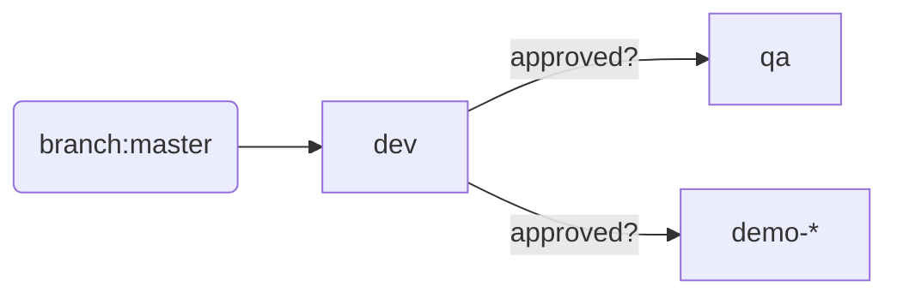
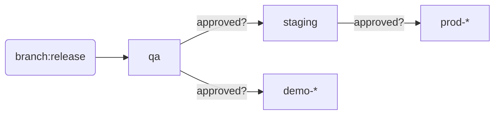

# Branch and deployment strategy

## Overview

> **IMPORTANT:** the strategy below accepts that most projects will not be able to have test automation that allows for a very short QA cycle (eg half a day or less). Hence,
assumes that a release branch is created to avoid a lengthy code freeze on the master/main branch. Ideally your project is working toward that goal of a short QA cycle. At which
point your project will not need a release branch, thus simplifying your delivery pipeline.

* Master/main is kept healthy and potentially deployable using PR code reviews and quality gates
* Developer feature flags will hide those features in production that are incomplete or not wanting to be made available to customers yet
* Release branch cut prior to production release and code hardened on release branch
* Release branch short-lived:
     * Only ever one release branch active at any given time
     * Only **one** version is supported in production
* Hotfix to production will only be made to the *active* release branch:
     * Where the current sprint has already cut a release branch, a bug fix in production is made to the release branch that represents the future deployment to production 
       ie the client WILL have to take the latest features
     * Where the current sprint has NOT cut a release branch, a bug fix in production will be made to the release branch that is currently deployed in production 
       ie the client will NOT have to take the latest features

## Deployment

### Code committed to PR branch

* build/test/publish
* NOT deployed

### Code committed to master branch

* Deployed to `dev` automatically (no approval required)
* Wait on release approval before deploying to `qa`:
  * `qa` deployment from master branch is not normally required as QA testing for current cards merged to master typically occurs in
     `dev` environment. However, QA might want to do testing in `qa` which is a more stable environment than `dev`.
     In that case, they can manually approve the deployment to `qa`
  * Avoid a deploy from release branch being overwritten by a deploy from master
* Wait on release approval before deploying to `demo`:
    * `demo` deployment from master branch is rare and usually only after stakeholder approval

### Code committed to release branch

* Deployed to `qa` automatically (no approval required)
* Wait on release approval before deploying to `staging`
* Once deployed to `staging`, wait on release approval before deploying to `demo` and `prod` environments

### Code merged from release branch to master

* code merged immediately to master - to avoid it being lost
* commit to master triggers build (see above)