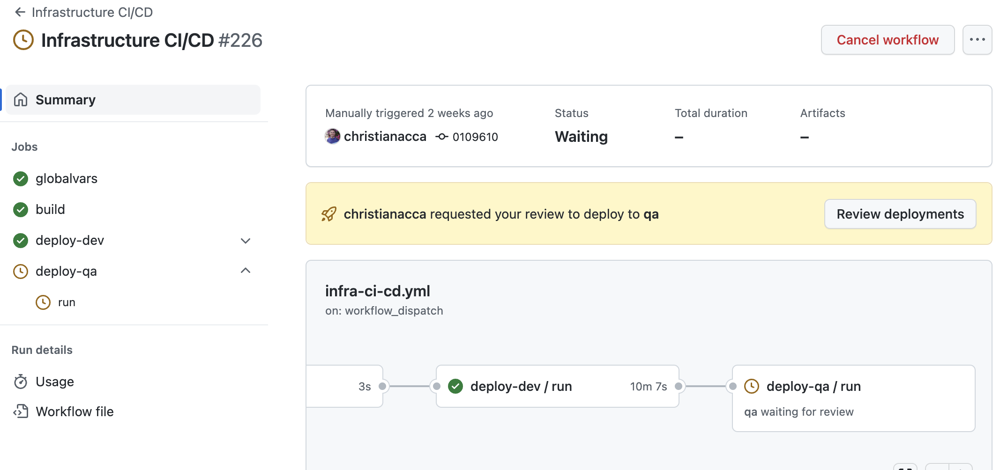
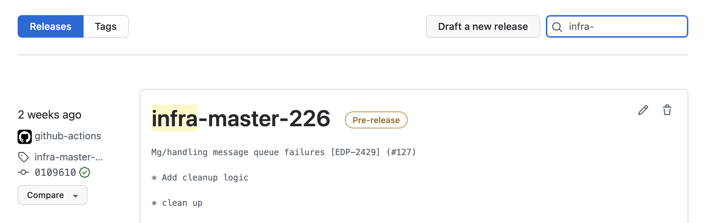
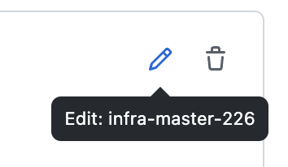
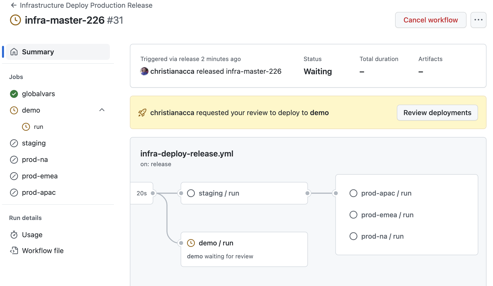
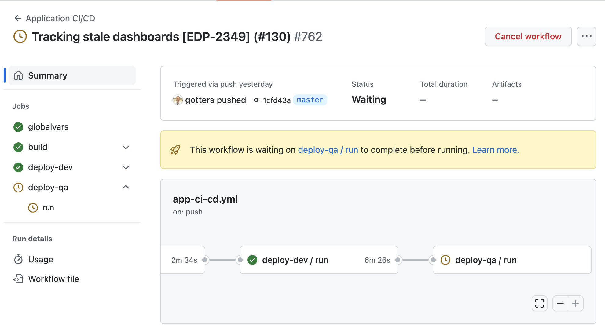
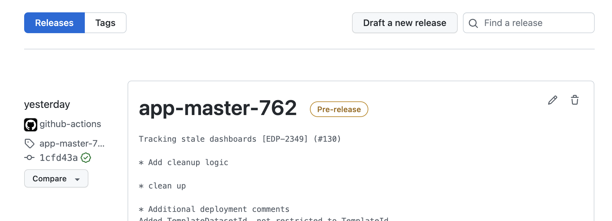
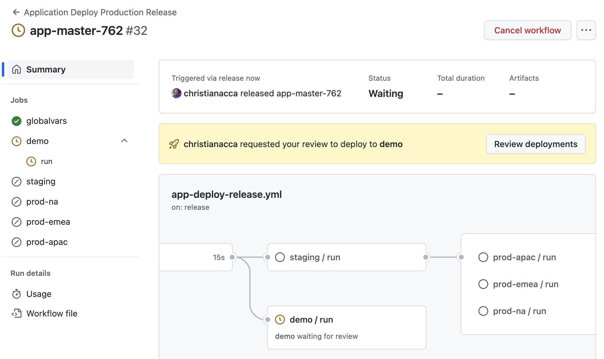
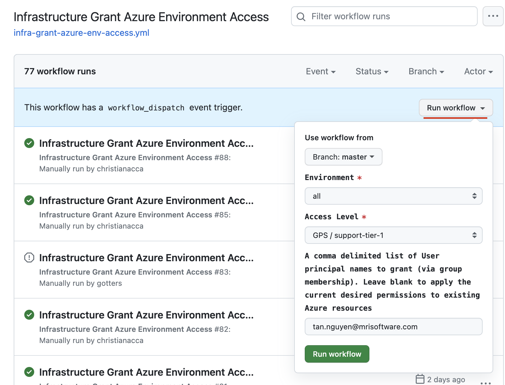
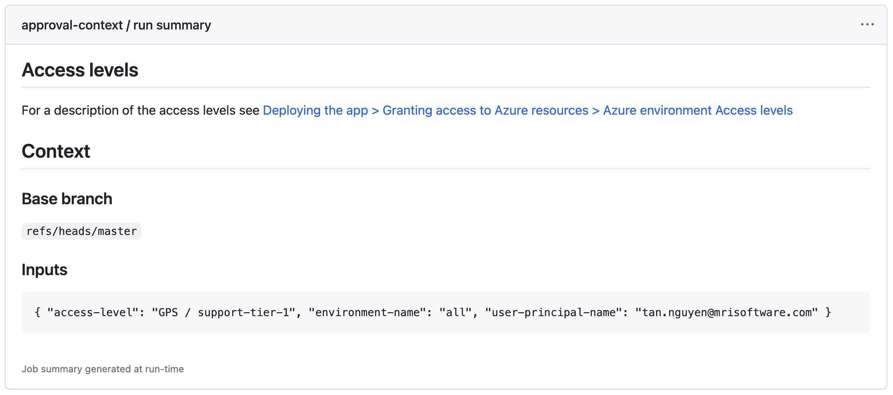
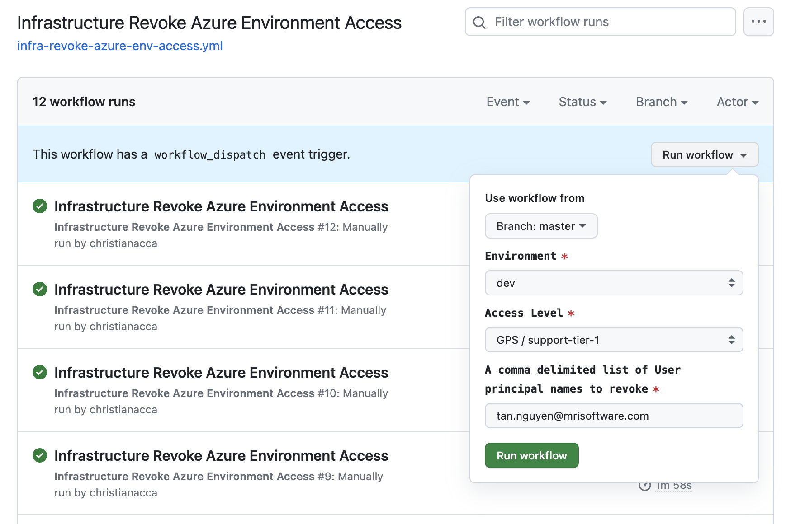

# Deploying the app

<!-- TOC -->
* [Deploying the app](#deploying-the-app)
  * [Overview](#overview)
  * [Shared services](#shared-services)
    * [Azure container registry](#azure-container-registry)
    * [Azure key vault for TLS certificates](#azure-key-vault-for-tls-certificates)
    * [Grant RBAC management permission for shared services](#grant-rbac-management-permission-for-shared-services)
  * [Register DNS records](#register-dns-records)
  * [Add whitelists to Cloudflare Web Application Firewall (WAF)](#add-whitelists-to-cloudflare-web-application-firewall-waf)
  * [Add TLS certificates to shared key vault](#add-tls-certificates-to-shared-key-vault)
  * [Infrastructure](#infrastructure)
  * [Deploying infrastructure from CI/CD](#deploying-infrastructure-from-cicd)
  * [Deploying app from CI/CD](#deploying-app-from-cicd)
  * [Granting access to Azure or Power-BI resources](#granting-access-to-azure-or-power-bi-resources)
    * [Steps](#steps)
  * [Revoking access to Azure resources](#revoking-access-to-azure-resources)
  * [Azure environment Access levels](#azure-environment-access-levels)
  * [Deploying (infrastructure + app) locally from dev machine](#deploying-infrastructure--app-locally-from-dev-machine)
    * [Prerequisites](#prerequisites)
    * [Permissions to run infrastructure scripts](#permissions-to-run-infrastructure-scripts)
    * [Steps](#steps-1)
  * [Cleanup](#cleanup)
    * [From a powershell prompt](#from-a-powershell-prompt)
    * [From the github workflow](#from-the-github-workflow)
  * [Troubleshooting `provision-azure-resources.ps1`](#troubleshooting-provision-azure-resourcesps1)
<!-- TOC -->

## Overview

At a high level deployment consists of:

1. Ensure shared services have been created and RBAC permissions assigned to allow for role assignments to be made
2. Register DNS records in the DNS zone for custom domain used by container apps
3. Add whitelists to Cloudflare Web Application Firewall (WAF) for the custom domains used by the container apps
4. Add TLS certificate(s) to shared key vault(s) that cover the custom domains used by the container apps
5. Deploying the infrastructure required for the app (see section ["Deploying infra from CI/CD"](#deploying-infra-from-cicd))
6. Grant access to the teams members to the resources in Azure for the environment (see section ["Granting access to Azure resources"](#granting-access-to-azure-resources))
7. Deploying the app into the infrastructure (see section ["Deploying app from CI/CD"](#deploying-app-from-cicd))

This repo contains various powershell scripts (see [tools/dev-scripts directory](../tools/dev-scripts)) that can be run from the command-line
to automate the deployment tasks above and [github workflows](../.github/workflows) that automate CI/CD pipelines for the same deployments.

For more information on how these github workflows for the project were set up: [create-github-actions-infrastructure-pipeline](create-github-actions-infrastructure-pipeline.md)

> [!WARNING]
> Before running **any** scripts of workflows, you must make sure to have created the service principals responsible for
> provisioning the product, for at least `dev` and `prod-na` environments. And to then include the details of those service principals
> in [set-azure-connection-variables.ps1](../.github/actions/azure-login/set-azure-connection-variables.ps1)
> This is because the `prod-na` subscription is used to create some/all of the shared services required by the app

## Shared services

The shared services required for the app are:
* Azure container registry (ACR)
* Azure key vault for TLS certificates

> [!Note]
> If there are multiple shared services for the same type required (for example two Azure container registries), you will
> need to run the workflow [Infrastructure Deploy Shared Services](../.github/workflows/infra-deploy-shared-services.yml)
> multiple times, picking the appropriate shared service and environment to deploy each time.

### Azure container registry

Azure container registry (ACR) services are maintained by other teams and are not part of the deployment process for the app. However,
if you do need to deploy the shared services, you can do so by running the following github workflow [Infrastructure Deploy Shared Services](../.github/workflows/infra-deploy-shared-services.yml),
with the 'Create shared container registry?' parameter selected.

### Azure key vault for TLS certificates

Azure key vault for TLS certificates may be maintained by other teams, but if you need to deploy this shared key vault(s),
you can do so by running the following github workflow [Infrastructure Deploy Shared Services](../.github/workflows/infra-deploy-shared-services.yml),
with the 'Create shared key vault?' parameter selected.

### Grant RBAC management permission for shared services

Once shared services have been created, you will need to assign the appropriate RBAC permissions to the shared services 
to allow for role assignments to be made. This can be done by running the following github workflow [Infrastructure Deploy Shared Services](../.github/workflows/infra-deploy-shared-services.yml) 
with the 'Grant RBAC management permission to provisioning service principals?' parameter selected.

## Register DNS records

> [!Note]
> Highly likely DNS zones are maintained by other teams and is not part of the deployment process for the app

> [!Important]
> This step needs to be repeated any time a new environment is provisioned

Each container app will be assigned a custom domain that will be used to access that app over https. The DNS records for
these custom domains must be registered in the DNS zone for that custom domain.

There are two DNS records that need to be registered _for each service_ (eg our API) hosted in Azure container apps, 
_for each environment_ that this service is being deployed to:

* `TXT` record required to validate domain ownership, EG name:`asuid.dev-api-was`; content:`xxxxxxxxx`
* `CNAME` record for the custom domain pointing to the traffic manager DNS name, EG name:`dev-api-was`; content:`dev-api-was.trafficmanager.net`

> [!WARNING]
> The `TXT` record must be added to the DNS zone before the azure container app can be created.

To find the values for the values for these DNS record for a specific environment, run the following script:

```pwsh
# note: replace 'dev, qa' with the environments you want to get the DNS records for. Leave blank to get all environments
./tools/infrastructure/print-custom-dns-record-table.ps1 dev, qa -Login
```

## Add whitelists to Cloudflare Web Application Firewall (WAF)

> [!Note]
> Highly likely WAF rules are maintained by other teams and is not part of the deployment process for the app

> [!Important]
> This step needs to be repeated any time a new environment is provisioned

The custom domains used by the container apps are proxied by Cloudflare. Cloudflare provides a Web Application Firewall (WAF).
This WAF will likely need to be tuned to not block legitimate traffic to the container apps.

Define the list of paths for a container app that should not be blocked in [get-product-conventions.ps1](../tools/infrastructure/get-product-conventions.ps1).
For example:

```pwsh
WafWhitelist    = @(
    @{
        Path            = '/api/pbireports/*/import', '/api/breeze/*'
        RulesToSkip     = 'OWASP Core Ruleset'
        Type            = 'cloudflare'
    }
)
```

Adjust these as necessary, and then run the following script to obtain the definitions of exception rules to be added to Cloudflare WAF:

```pwsh
./tools/infrastructure/print-waf-whitelist-list.ps1
```

An example output of the script above:

```cmd

Zone Name: codingdemo.co.uk
Rule Name: Web API Starter - OWASP Core Ruleset Skips
Rules to skip: OWASP Core Ruleset
Rule Expression...

(http.host eq "dev-api-was.codingdemo.co.uk" and starts_with(lower(http.request.uri.path), "/api/internal/")) or 
(http.host eq "dev-api-was.codingdemo.co.uk" and starts_with(lower(http.request.uri.path), "/api/pbireports/") and ends_with(lower(http.request.uri.path), "/import")) or 
(http.host eq "na-api-was.codingdemo.co.uk" and starts_with(lower(http.request.uri.path), "/api/internal/")) or 
(http.host eq "na-api-was.codingdemo.co.uk" and starts_with(lower(http.request.uri.path), "/api/pbireports/") and ends_with(lower(http.request.uri.path), "/import")) or 
(http.host eq "qa-api-was.codingdemo.co.uk" and starts_with(lower(http.request.uri.path), "/api/internal/")) or 
(http.host eq "qa-api-was.codingdemo.co.uk" and starts_with(lower(http.request.uri.path), "/api/pbireports/") and ends_with(lower(http.request.uri.path), "/import"))

```

Consult the Cloudflare documentation for how to add these exceptions to the WAF: [Cloudflare | Managed rules | Create exceptions](https://developers.cloudflare.com/waf/managed-rules/waf-exceptions/)

> [!Important]
> Make sure the custom exception is added in the list before the ruleset it's intending to skip

> [!Note]
> If you are using the free tier of Cloudflare, you will need to add the above WAF exceptions to a custom rule instead.
> Custom rules only allow you to skip the free managed ruleset provided by Cloudflare. For details on how to add
> custom rules see [Cloudflare | Custom rules](https://developers.cloudflare.com/waf/custom-rules/skip/)

## Add TLS certificates to shared key vault

> [!Note]
> Highly likely TLS certificates are maintained by other teams and is not part of the deployment process for the app

> [!Important]
> In order to import certificates as instructed below, you will need to be a member of the MS Entra-ID security group
> 'sg.role.it.itops.cloud'

TLS certificates are required for the custom domains used by the container apps. These certificates must be added to the
shared key vault(s) that are used by the app.

The process for sourcing these certificates is application specific. Some options include:

* use managed certificates from Azure Container Apps 
  * see [offical docs](https://learn.microsoft.com/en-us/azure/container-apps/custom-domains-managed-certificates?pivots=azure-cli)
  * **IMPORTANT**: this method will not work for solutions that use Azure traffic manager to route traffic to the container apps
* use key vault to automatically create/renew certificates using a CA
  * see [Creating a certificate with a CA partnered with Key Vault](https://learn.microsoft.com/en-us/azure/key-vault/certificates/certificate-scenarios#creating-a-certificate-with-a-ca-partnered-with-key-vault)
* use Cloudflare to proxy the custom domain and provide an origin server TLS certificate, then import these certificates
  into a key vault
  * see [Cloudflare | Origin CA certificates](https://developers.cloudflare.com/ssl/origin-configuration/origin-ca/)
  * this is a good choice for the budget conscious as Cloudflare 1) provides free certificates for the end user of the 
    site/api served by the container apps, and 2) provides a free Web Application Firewall (WAF) to protect the site/api

This project assumes that Cloudflare method is being used. The following guidance provides an overview of the steps
required to set up Cloudflare acting as a proxy for the custom domain, and importing the origin server TLS certificate
into a shared key vault accessible by the app:

1. Create a Cloudflare account and ensure that the cloudflare is the authoritative DNS server for the custom domain
   * see [Cloudflare | Add your domain to Cloudflare](https://developers.cloudflare.com/learning-paths/get-started/add-domain-to-cf/)
2. [Add a site](https://developers.cloudflare.com/fundamentals/setup/manage-domains/add-site/) in Cloudflare and configure SSL/TLS so that:
   * Edge TLS certificates are generated by Cloudflare ([universal SSL](https://developers.cloudflare.com/ssl/edge-certificates/universal-ssl/) certs are free)
   * Encryption mode is 'Full (strict)' so that Cloudflare uses SSL between its proxy and our origin server 
     (for details see [Cloudflare | Encryption modes](https://developers.cloudflare.com/ssl/origin-configuration/ssl-modes/)
   * Cloudflare Origin cert is generated for the custom domain. By default, this certificate will be valid for 15 years
     (see [Cloudflare | Origin CA certificates](https://developers.cloudflare.com/ssl/origin-configuration/origin-ca/))
3. Download the Cloudflare Origin cert and private key as a PEM file
4. Import the Cloudflare Origin cert PEM file into the shared key vault
   * see [Azure Key Vault | Import a certificate](https://learn.microsoft.com/en-us/azure/key-vault/certificates/tutorial-import-certificate?tabs=azure-portal)

> [!Note]
> The certificate for both production and non-production might be the same, and may be stored in the same key vault accessible by all environments.
> Or the certificates might be different, and stored in different key vaults, accessible only by the environment that requires it.
> Or the certificates might be the same, but separate copies stored in different key vaults, accessible only by the environment that requires it.
> The convention configuration for the project determines these choices.

To find the origin SSL certificates required to cover non-production environments, run the following script:

```pwsh
(./tools/infrastructure/get-product-conventions.ps1 -EnvironmentName dev -AsHashtable).TlsCertificates.Dev | select `
   @{ n='CertificateName'; e={ $_.ResourceName } }, `
   @{ n='SubjectAlternateNames'; e={ $_.SubjectAlternateNames -join ',' } }, `
   ZoneName, `
   @{ n='KeyVaultName'; e={ $_.KeyVault.ResourceName } }, `
   @{ n='KeyVaultResourceGroup'; e={ $_.KeyVault.ResourceGroupName } }
```

To find the origin SSL certificates required to cover production environments, run the following script:

```pwsh
(./tools/infrastructure/get-product-conventions.ps1 -EnvironmentName dev -AsHashtable).TlsCertificates.Prod | select `
   @{ n='CertificateName'; e={ $_.ResourceName } }, `
   @{ n='SubjectAlternateNames'; e={ $_.SubjectAlternateNames -join ',' } }, `
   ZoneName, `
   @{ n='KeyVaultName'; e={ $_.KeyVault.ResourceName } }, `
   @{ n='KeyVaultResourceGroup'; e={ $_.KeyVault.ResourceGroupName } }
```

## Infrastructure

> [!Note]
> Image represents deployment to the dev environment.
> Other environments will have the same resources but with different names, plus production and qa environments will also have failover instances for SQL and ACA pods

**TODO: Add image describing infrastructure deployment**

> Also see output from [print-product-convention-table.ps1](../tools/infrastructure/print-product-convention-table.ps1)

## Deploying infrastructure from CI/CD

> [!Tip]
> To discover the configuration values used during deployment run: `./tools/infrastructure/get-product-conventions.ps1`

1. Trigger build by _either_:
   * Touching any file in tools/infrastructure on the `master` branch (via a PR)
   * Manually running [Infrastructure CI/CD](../.github/workflows/infra-ci-cd.yml) workflow
   * Create a `release/*` branch (eg release/2022.01). Note: this is the only method to deploy to staging and prod environments as explained in [Branch and deployment strategy](branch-and-deployment-strategy.md)
2. Deploy to dev: [Infrastructure CI/CD](../.github/workflows/infra-ci-cd.yml) will trigger *automatically* to deploy infrastructure to dev environment (ie you don't need to do anything)
3. Deploy to qa: once deployed to the dev environment, the [Infrastructure CI/CD](../.github/workflows/infra-ci-cd.yml) workflow will queue up a deployment for the infrastructure to the qa environment.
   
   This deployment will need to be reviewed then [approved in github](https://docs.github.com/en/actions/managing-workflow-runs/reviewing-deployments)
4. Deploy to demo, staging, prod-xxx environments:
   1. Go to the [Releases list](https://github.com/MRI-Software/web-api-startery/releases) in the github repo
   2. Find the pre-release that you want to deploy, it will start with 'infra-master-' or 'infra-release-'
      
   3. To deploy the release, select the 'Edit' option, _**uncheck**_ 'Set as pre-release', and then select 'Update release'. This will start the execution of the deployment

      

      

   4. Approve the deployment to demo and/or staging, and then to production:
      1. Open the [Infrastructure Deploy Production Release](../.github/workflows/infra-deploy-release.yml) workflow run just started that has the name of the release you're just published above
      2. [Approve](https://docs.github.com/en/actions/managing-workflow-runs/reviewing-deployments) the environment(s) listed in the UI to allow the deployment to continue for each of those respective environments
         
         **IMPORTNT**: the option to deploy to staging and prod environments will be enabled only when the branch that triggered the initial workflow is a release branch (eg release/2022.01)


## Deploying app from CI/CD

> [!Tip]
> To discover the configuration values used during deployment run: `./tools/infrastructure/get-product-conventions.ps1`

1. Trigger build by _either_:
   * Touching any file in tools/infrastructure on the `master` branch (via a PR)
   * Manually running [Application CI/CD](../.github/workflows/app-ci-cd.yml) workflow
   * Create a `release/*` branch (eg release/2022.01). Note: this is the only method to deploy to staging and prod environments as explained in [Branch and deployment strategy](branch-and-deployment-strategy.md)
2. Deploy to dev: [Application CI/CD](../.github/workflows/app-ci-cd.yml) will trigger *automatically* to deploy app to dev environment (ie you don't need to do anything)
3. Deploy to qa: once deployed to the dev environment, the [Application CI/CD](../.github/workflows/app-ci-cd.yml) workflow will queue up a deployment for the app to the qa environment.
   
   This deployment will need to be reviewed then [approved in github](https://docs.github.com/en/actions/managing-workflow-runs/reviewing-deployments)
4. Deploy application to demo, staging, prod-xxx environments:
   1. Go to the [Releases list](https://github.com/MRI-Software/web-api-starter/releases) in the github repo
   2. Find the pre-release that you want to deploy, it will start with 'app-master-' or 'app-release-'
      
   3. To deploy the release, select the 'Edit' option, **_uncheck_** 'Set as pre-release', and then select 'Update release'. This will start the execution of the deployment

      

      

   4. Approve the deployment to staging:
      1. Open the [Application Deploy Production Release](../.github/workflows/app-deploy-release.yml) workflow execution just started that has the name of the release you're just published above
      2. [Approve]((https://docs.github.com/en/actions/managing-workflow-runs/reviewing-deployments)) the environment(s) listed in the UI to allow the deployment to continue for each of those respective environments
         
         **IMPORTNT**: the option to deploy to staging and prod environments will be enabled only when the branch that triggered the initial workflow is a release branch (eg release/2022.01)

## Granting access to Azure or Power-BI resources

### Steps

1. Decide on the access level for each person (see 'Access levels' section below)
2. Open the github workflow [Infrastructure Grant Azure Environment Access](../.github/workflows/infra-grant-azure-env-access.yml)
3. Select the "Run workflow" button
   
4. In the dialog:
   1. Select the Environment to which to grant access (select 'all' to expedite the process considerably)
   2. Select the Access level that is appropriate for the person (see below for description of each access level)
   3. Select the Scope that is appropriate for the person:
      * 'global' for access to all resources in the environment
      * 'pbi' for access to only pbi resources in the environment
   4. In 'A comma delimited list of User principal names to grant' add the email address of the person(s) to grant access
   5. Select 'Run workflow' button
5. For all environments except dev, the workflow run will need to be reviewed then [approved in github](https://docs.github.com/en/actions/managing-workflow-runs/reviewing-deployments)
   * See example workflow run screenshots below
   * Those members of the [Web API Starter - Production approver](https://github.com/orgs/MRI-Software/teams/web-api-starter-production-approver/members) will be able to approve

Once approved, the Azure RBAC permissions and Microsoft Entra ID security group membership applicable to the selections above will be provisioned to the resources in Azure.

To check existing access, run the following script:

```pwsh
# zfbl5.onmicrosoft.com (Christian's dev AD tenant): 77806292-ec65-4665-8395-93cb7c9dbd36
az login --tenant xxxxxxxx-xxxx-xxxxxxxxx-xxxxxxxxxxxx --allow-no-subscriptions

# display membership grouped by scope and tier:
./tools/infrastructure/get-teams-membership-info.ps1 -AsArray | Sort-Object Scope, Tier, Env |
  Format-Table Env, GroupName, Member -GroupBy @{ n='Scope,Tier'; e={ '{0}:{1}' -f $_.Scope, $_.Tier }}
```

_Example workflow run:_





## Revoking access to Azure resources

1. Open the github workflow [Infrastructure Revoke Azure Environment Access](../.github/workflows/infra-revoke-azure-env-access.yml)
2. Select the "Run workflow" button\
   
3. In the dialog:
   1. Select the Environment to which to revoke access
   2. Select the Access level that's to be revoked for the person
   3. Select the Scope to be revoked for the person:
      * 'global' for access to all resources in the environment
      * 'pbi' for access to only pbi resources in the environment
   4. In 'User to revoke' add the email address of the person to revoke access
   5. Select 'Run workflow' button
4. For all environments except dev, the workflow run will need to be reviewed then [approved in github](https://docs.github.com/en/actions/managing-workflow-runs/reviewing-deployments)


## Azure environment Access levels

***global* access:**

1. development
   * dev, qa, rel:
     * admin access to AIG Azure SQL db
     * contributor access to Azure resources (_including_ access to keyvault)
     * admin access to power-bi client workspaces
   * demo:
     * data read/write access to AIG Azure SQL db
     * contributor access to Azure resources (no access to keyvault)
     * contributor access to power-bi client workspaces
   * staging and prod:
     * data read access to AIG Azure SQL db
     * contributor access to Azure monitor, read access to all other Azure resources (no access to keyvault)
     * no access to power-bi client workspace
2. GPS / support-tier-1
   * demo, staging and prod environments:
     * data read access to AIG Azure SQL db
     * read access to Azure (no access to keyvault)
     * contributor rights to power-bi client _report_ workspaces
     * viewer rights to power-bi client _dataset_ workspaces
3. App Admin / support-tier-2
   * demo, staging and prod environments:
     * contributor access to AIG Azure SQL db
     * contributor access to Azure (_including_ access to keyvault)
     * admin rights to power-bi client _report_ workspaces
     * admin rights to power-bi client _dataset_ workspaces

***pbi* only access:**

1. development
   * dev, qa, rel: admin access to power-bi client workspaces
   * demo: contributor access to power-bi client workspaces
   * staging and prod: no access to power-bi client workspace
2. GPS / support-tier-1
   * demo, staging and prod environments:
     * contributor rights to power-bi client _report_ workspaces
     * viewer rights to power-bi client _dataset_ workspaces
3. App Admin / support-tier-2
   * demo, staging and prod environments:
     * admin rights to power-bi client _report_ workspaces
     * admin rights to power-bi client _dataset_ workspaces

To provide a comprehensive list of permissions per environment execute [print-product-convention-table.ps1](../tools/infrastructure/print-product-convention-table.ps1),
specifically, the example with the description "Returns tables describing all Azure RBAC and Azure ADD security group membership"


## Deploying (infrastructure + app) locally from dev machine

> [!CAUTION]
> Creating the infrastructure from your local dev machine using the provision script below (./tools/infrastructure/provision-azure-resources.ps1)
> will likely cause the Infrastructure CI/CD pipeline to fail for the environment that you deployed too locally.
> This is because the AAD groups will be created with your identity as the owner, and NOT the service principal that the
> pipeline uses. This will cause the pipeline to fail when it tries to add a group member

### Prerequisites

* [az-cli](https://docs.microsoft.com/en-us/cli/azure/install-azure-cli) (**minimum vs 2.39.0**), required to run dev scripts
* [Azure bicep cli](https://learn.microsoft.com/en-us/azure/azure-resource-manager/bicep/install#install-manually) (**minimum vs 0.29.45**). **IMPORTANT**, ensure you have the minimum version installed as the
  standalone cli and the one packaged by az-cli.
  * Both standalone and packed version are required and can be installed by following the [official guide](https://learn.microsoft.com/en-gb/azure/azure-resource-manager/bicep/install))
  * To upgrade the packaged version run: `az bicep upgrade`
  * To upgrade the standalone version:
    * MacOS: `brew upgrade bicep`
    * Windows: `choco upgrade bicep`
* powershell core (tested on v7.2)
* docker engine to run the [build.ps1](../tools/dev-scripts/build.ps1)) script with the flag `-DockerPush`

### Permissions to run infrastructure scripts

You are unlikely to have permissions to run the infrastructure provisioning scrips (step 3 below) from your dev machine :-(
In practice the only way to run these scripts from a dev machine is:

1. To have your own Azure subscription where you are the owner, AND
2. The Azure subscription is linked to a developer Azure Entra-ID tenant created using the Microsoft 365 developer program. See the following on how to get this setup:
   1. sign-up for the MS 365 developer program: <https://developer.microsoft.com/en-us/microsoft-365/dev-program>
   2. linking your VS subscription to your office365 dev tenant: <https://laurakokkarinen.com/how-to-use-the-complimentary-azure-credits-in-a-microsoft-365-developer-tenant-step-by-step/>
   3. things to be aware of when moving your VS subscription to another AD tenant: <https://docs.microsoft.com/en-us/azure/role-based-access-control/transfer-subscription>

### Steps

> [!NOTE]
> The steps below assume you are deploying to your own Azure subscription and Azure Entra-ID tenant

1. Modify product conventions to avoid conflicts for those azure resource whose names are globally unique:
   1. open [get-product-conventions.ps1](../tools/infrastructure/get-product-conventions.ps1)
   2. set `CompanyName` (line 20) to make it globally unique (eg change `CLC` to your initials)
   3. uncomment `ProductAbbreviation` (line 22) and make it globally unique (eg replace `-cc` with your initials)
   4. Review `Domain` settings (starting line 23) and adjust as required. At minimum replace 'codingdemo' with the value of a custom domain you own
2. Setup shared infrastructure:
   ```pwsh
   # 'CC - Visual Studio Enterprise' subscription id: 402f88b4-9dd2-49e3-9989-96c788e93372
   ./tools/infrastructure/provision-shared-services.ps1 -InfA Continue -EnvironmentName dev -CreateSharedContainerRegistry -CreateSharedKeyVault -Login -SubscriptionId xxxxxxxx-xxxx-xxxxxxxxx-xxxxxxxxxxxx
    ````
3. Update the subscription id in [set-azure-connection-variables.ps1](../.github/actions/azure-login/set-azure-connection-variables.ps1) to your own subscription id
4. Provision Azure resources:
   ```pwsh
   # 'CC - Visual Studio Enterprise' subscription id: 402f88b4-9dd2-49e3-9989-96c788e93372
   ./tools/infrastructure/provision-azure-resources.ps1 -InfA Continue -EnvironmentName dev -Login -SubscriptionId xxxxxxxx-xxxx-xxxxxxxxx-xxxxxxxxxxxx
   ````
   * NOTE: if this script fails try running it again (script is idempotent). For more details see troubleshooting section below
5. Build App: 
   ```pwsh
   az login
   # 'CC - Visual Studio Enterprise' subscription id: 402f88b4-9dd2-49e3-9989-96c788e93372
   az account set --subscription xxxxxxxx-xxxx-xxxxxxxxx-xxxxxxxxxxxx
   ./tools/dev-scripts/build.ps1 -DockerPush -InfA Continue
   ```
    * **IMPORTANT**: You will need to have docker engine installed and running on your machine in order to build and push the images
6. Deploy App:
   ```pwsh
   # IMPORTANT: You will likely need to connected to the office VPN in order to satisfy the firewall rules configured in the Azure SQL db
   # 'CC - Visual Studio Enterprise' subscription id: 402f88b4-9dd2-49e3-9989-96c788e93372
   ./tools/dev-scripts/deploy.ps1 -InfA Continue -Login -SubscriptionId xxxxxxxx-xxxx-xxxxxxxxx-xxxxxxxxxxxx
   ````
7. Test that it worked:
   * browse to the "Api health Url" printed to the console
   * Import the postman [collection](../tests/postman/api.postman_collection.json) and [environment](../tests/postman/api-dev.postman_environment.json),
     change the baseUrl postman variable to the "Api Url" printed to the console. Run the requests in the collection


## Cleanup

To remove all Azure resources run the deprovision-azure-resources.ps1 script from a powershell prompt (assuming you have permissions),
or running the github workflow [Infrastructure Uninstall](../.github/workflows/infra-uninstall.yml)

### From a powershell prompt

```pwsh
# 'CC - Visual Studio Enterprise' subscription id: 402f88b4-9dd2-49e3-9989-96c788e93372
./tools/infrastructure/deprovision-azure-resources.ps1 -InfA Continue -Environment xxx -DeleteAADGroups -Login -SubscriptionId xxxxxxxx-xxxx-xxxxxxxxx-xxxxxxxxxxxx
```

### From the github workflow

1. Go to the Actions tab in the github repo
2. Manually run the workflow 'Infrastructure Uninstall', selecting the name of the environment to uninstall from


## Troubleshooting `provision-azure-resources.ps1`

### Problem deploying SQL server

When running `provision-azure-resources.ps1`, you might receive an error with the following message:

```cmd
Login failed for user '<token-identified principal>'
```
To resolve the problem try re-running the provisioning script again (it's safe to do so). If this still does not work try
waiting for somewhere between 15-60 minutes and re-run the script.

### Problem deploying one or more Entra-ID app registrations

When running `provision-azure-resources.ps1`, you might receive an error with a _similar_ message to the following:

```cmd
7. Set Azure resources...
  Gathering existing resource information...
  Creating desired resource state

Write-Error: /home/runner/work/_temp/18abd4a5-7265-4ba2-a12f-9e2013b9649f.ps1:2
Line |
   2 |  ./tools/infrastructure/provision-azure-resources.ps1 -EnvironmentName …
     |  ~~~~~~~~~~~~~~~~~~~~~~~~~~~~~~~~~~~~~~~~~~~~~~~~~~~~~~~~~~~~~~~~~~~~~
     | 12:45:07 - The deployment 'd2933a88-733d-4b65-afd6-6f8b76eb6546' failed
     | with error(s). Showing 2 out of 2 error(s). Status Message:
     | {"error":{"code":"BadRequest","target":"/resources/appReg","message":"Another object with the same value for property 
uniqueName already exists. Graph client request id: ed2e5d64-4a96-417b-b5ec-109288d212b9. Graph request timestamp: 2024-11-28T12:42:10Z."}} 
(Code:DeploymentOperationFailed)  Status Message: At least one resource deployment operation failed. Please list deployment operations for 
details. Please see https://aka.ms/arm-deployment-operations for usage details. (Code: DeploymentFailed)
  - {"error":{"code":"BadRequest","target":"/resources/appReg","message":"Another object with the same value for property uniqueName already exists.
Graph client request id: ed2e5d64-4a96-417b-b5ec-109288d212b9. Graph request timestamp: 2024-11-28T12:42:10Z."}} (Code:)   
CorrelationId: 5a5d3700-d51d-441b-9a8e-c9634f3a5221 at <ScriptBlock><Process>, /home/runner/work/web-api-starter/web-api-starter/tools/infrastructure/provision-azure-resources.ps1: line 318 at <ScriptBlock>, /home/runner/work/_temp/18abd4a5-7265-4ba2-a12f-9e2013b9649f.ps1: line 2 at <ScriptBlock>, <No file>: line 1
```

To resolve:

1. browse to [Entra-ID app registrations](https://portal.azure.com/#view/Microsoft_AAD_IAM/ActiveDirectoryMenuBlade/~/RegisteredApps) in the tenant the infrastructure being deployed to
2. open the "Deleted applications" tab
3. look for any application that matches the app registrations that the infra-as-code script is responsible for deploying:
   * the app registrations follow the naming convention func-[company_abbrev]-[product_abbrev]-[env]-[component_name] eg func-clc-was-dev-internalapi
4. delete permanently these soft deleted applications
   * select the applications you noted above
   * select the "Delete permanently" button
   * wait until the application is permanently deleted (might take up to a minute)
5. retry the failing infrastructure workflow run

### Problem Activating initial container app

After successfully running `provision-azure-resources.ps1` for the first time for the environment, but before you have
deployed the application that's hosted by the infrastructure (ie before running [deploy.ps1](../tools/dev-scripts/deploy.ps1) 
or the git workflow [Application CI/CD](../.github/workflows/app-ci-cd.yml))), you will see that the container app has
failed to start and in the "Revisions and issues" tab for the container it will show the error "Activation failed".

This is expected behaviour right now due to the initial docker container image that is deployed to the container app
during the initial infrastructure deployment. This initial docker image exposes port 80, but the container app is 
configured expected to expose port 8080.

This issue will be resolved when the application docker image is deployed to the container app.

