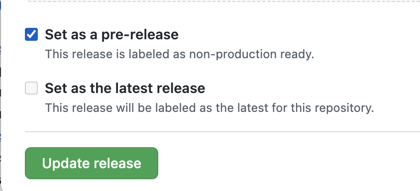
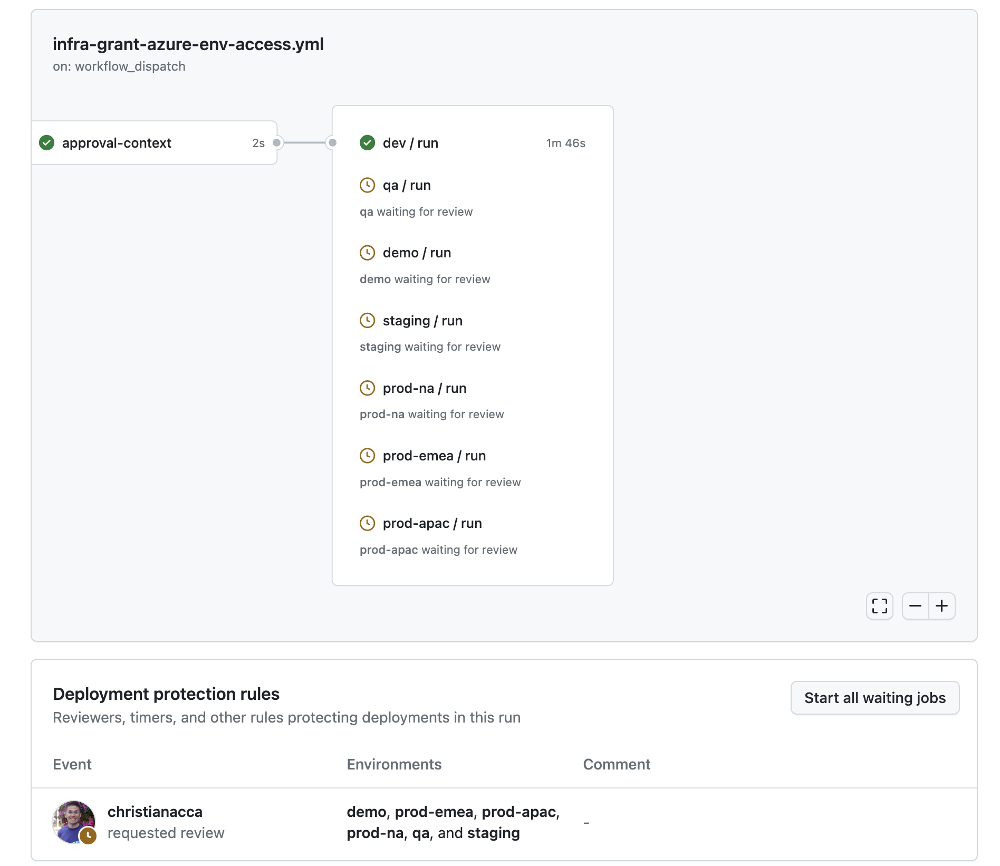

# Deploying the app

<!-- TOC -->
* [Deploying the app](#deploying-the-app)
  * [Overview](#overview)
  * [Shared services](#shared-services)
  * [Infrastructure](#infrastructure)
  * [Deploying infrastructure using CI/CD](#deploying-infrastructure-using-cicd)
  * [Deploying app from CI/CD](#deploying-app-from-cicd)
  * [Granting access to Azure or Power-BI resources](#granting-access-to-azure-or-power-bi-resources)
    * [Steps](#steps)
    * [Revoking access to Azure resources](#revoking-access-to-azure-resources)
    * [Azure environment Access levels](#azure-environment-access-levels)
  * [Deploying (infrastructure + app) locally from dev machine](#deploying-infrastructure--app-locally-from-dev-machine)
    * [Prerequisites](#prerequisites)
    * [Permissions to run infrastructure scripts](#permissions-to-run-infrastructure-scripts)
    * [Steps](#steps-1)
  * [Cleanup](#cleanup)
    * [From a powershell prompt](#from-a-powershell-prompt)
    * [From the github workflow](#from-the-github-workflow)
  * [Troubleshooting `provision-azure-resources.ps1`](#troubleshooting-provision-azure-resourcesps1)
<!-- TOC -->

## Overview

At a high level deployment consists of:

1. Ensure shared services have been created and RBAC permissions assigned to allow for role assignments to be made
2. Deploying the infrastructure required for the app (see section ["Deploying infra from CI/CD"](#deploying-infra-from-cicd))
3. Grant access to the teams members to the resources in Azure for the environment (see section ["Granting access to Azure resources"](#granting-access-to-azure-resources))
4. Deploying the app into the infrastructure (see section ["Deploying app from CI/CD"](#deploying-app-from-cicd))


This repo contains various powershell scripts (see [tools/dev-scripts directory](../tools/dev-scripts)) that can be run from the command-line 
to automate the deployment tasks above and [github workflows](../.github/workflows) that automate CI/CD pipelines for the same deployments.

For more information on how these github workflows for the project were set up: [create-github-actions-infrastructure-pipeline](create-github-actions-infrastructure-pipeline.md)

## Shared services

The shared services required for the app are:
* Azure container registry (ACR)
* Azure key vault for TLS certificates

> [!Note]
> If there are multiple shared services required, you will need to run the workflow [Infrastructure Deploy Shared Services](../.github/workflows/infra-deploy-shared-services.yml) multiple times, picking the appropriate shared service and environment to deploy each time.

Azure container registry (ACR) services are maintained by other teams and are not part of the deployment process for the app. However,
if you do need to deploy the shared services, you can do so by running the following github workflow [Infrastructure Deploy Shared Services](../.github/workflows/infra-deploy-shared-services.yml),
with the 'Create shared container registry?' parameter selected.

Azure key vault for TLS certificates may be maintained by other teams, but if you need to deploy this shared key vault(s),
you can do so by running the following github workflow [Infrastructure Deploy Shared Services](../.github/workflows/infra-deploy-shared-services.yml),
with the 'Create shared key vault?' parameter selected.

Once shared services have been created, you will need to assign the appropriate RBAC permissions to the shared services to allow for role assignments to be made.
This can be done by running the following github workflow [Infrastructure Deploy Shared Services](../.github/workflows/infra-deploy-shared-services.yml) with the
'Grant RBAC management permission to provisioning service principals?' parameter selected.

## Infrastructure

> [!Note]
> Image represents deployment to the dev environment. 
> Other environments will have the same resources but with different names, plus production and qa environments will also have failover instances for SQL and ACA pods

**TODO: Add image describing infrastructure deployment**

> Also see output from [print-product-convention-table.ps1](../tools/infrastructure/print-product-convention-table.ps1)

## Deploying infrastructure using CI/CD

> [!Tip]
> To discover the configuration values used during deployment run: `./tools/infrastructure/get-product-conventions.ps1`

1. Trigger build by _either_:
   * Touching any file in tools/infrastructure on the `master` branch (via a PR)
   * Manually running [Infrastructure CI/CD](../.github/workflows/infra-ci-cd.yml) workflow
   * Create a `release/*` branch (eg release/2022.01). Note: this is the only method to deploy to staging and prod environments as explained in [Branch and deployment strategy](branch-and-deployment-strategy.md)
2. Deploy to dev: [Infrastructure CI/CD](../.github/workflows/infra-ci-cd.yml) will trigger *automatically* to deploy infrastructure to dev environment (ie you don't need to do anything)
3. Deploy to qa: once deployed to the dev environment, the [Infrastructure CI/CD](../.github/workflows/infra-ci-cd.yml) workflow will queue up a deployment for the infrastructure to the qa environment.
   
   This deployment will need to be reviewed then [approved in github](https://docs.github.com/en/actions/managing-workflow-runs/reviewing-deployments)
4. Deploy to demo, staging, prod-xxx environments:
   1. Go to the [Releases list](https://github.com/MRI-Software/web-api-startery/releases) in the github repo
   2. Find the pre-release that you want to deploy, it will start with 'infra-master-' or 'infra-release-'
      
   3. To deploy the release, select the 'Edit' option, _**uncheck**_ 'Set as pre-release', and then select 'Update release'. This will start the execution of the deployment

      

      

   4. Approve the deployment to demo and/or staging, and then to production:
      1. Open the [Infrastructure Deploy Production Release](../.github/workflows/infra-deploy-release.yml) workflow run just started that has the name of the release you're just published above
      2. [Approve](https://docs.github.com/en/actions/managing-workflow-runs/reviewing-deployments) the environment(s) listed in the UI to allow the deployment to continue for each of those respective environments
         
         **IMPORTNT**: the option to deploy to staging and prod environments will be enabled only when the branch that triggered the initial workflow is a release branch (eg release/2022.01)


## Deploying app from CI/CD

> [!Tip]
> To discover the configuration values used during deployment run: `./tools/infrastructure/get-product-conventions.ps1`

1. Trigger build by _either_:
   * Touching any file in tools/infrastructure on the `master` branch (via a PR)
   * Manually running [Application CI/CD](../.github/workflows/app-ci-cd.yml) workflow
   * Create a `release/*` branch (eg release/2022.01). Note: this is the only method to deploy to staging and prod environments as explained in [Branch and deployment strategy](branch-and-deployment-strategy.md)
2. Deploy to dev: [Application CI/CD](../.github/workflows/app-ci-cd.yml) will trigger *automatically* to deploy app to dev environment (ie you don't need to do anything)
3. Deploy to qa: once deployed to the dev environment, the [Application CI/CD](../.github/workflows/app-ci-cd.yml) workflow will queue up a deployment for the app to the qa environment.
   
   This deployment will need to be reviewed then [approved in github](https://docs.github.com/en/actions/managing-workflow-runs/reviewing-deployments)
4. Deploy application to demo, staging, prod-xxx environments:
   1. Go to the [Releases list](https://github.com/MRI-Software/web-api-starter/releases) in the github repo
   2. Find the pre-release that you want to deploy, it will start with 'app-master-' or 'app-release-'
      
   3. To deploy the release, select the 'Edit' option, **_uncheck_** 'Set as pre-release', and then select 'Update release'. This will start the execution of the deployment

      

      

   4. Approve the deployment to demo and/or staging, and then to production:
      1. Open the [Application Deploy Production Release](../.github/workflows/app-deploy-release.yml) workflow execution just started that has the name of the release you're just published above
      2. [Approve]((https://docs.github.com/en/actions/managing-workflow-runs/reviewing-deployments)) the environment(s) listed in the UI to allow the deployment to continue for each of those respective environments
         
         **IMPORTNT**: the option to deploy to staging and prod environments will be enabled only when the branch that triggered the initial workflow is a release branch (eg release/2022.01)

## Granting access to Azure or Power-BI resources

### Steps

1. Decide on the access level for each person (see 'Access levels' section below)
2. Open the github workflow [Infrastructure Grant Azure Environment Access](../.github/workflows/infra-grant-azure-env-access.yml)
3. Select the "Run workflow" button
   
4. In the dialog:
    1. Select the Environment to which to grant access (select 'all' to expedite the process considerably)
    2. Select the Access level that is appropriate for the person (see below for description of each access level)
    3. Select the Scope that is appropriate for the person:
        * 'global' for access to all resources in the environment
        * 'pbi' for access to only pbi resources in the environment
    4. In 'A comma delimited list of User principal names to grant' add the email address of the person(s) to grant access
    5. Select 'Run workflow' button
5. For all environments except dev, the workflow run will need to be reviewed then [approved in github](https://docs.github.com/en/actions/managing-workflow-runs/reviewing-deployments)
   * See example workflow run screenshots below
   * Those members of the [Web API Starter - Production approver](https://github.com/orgs/MRI-Software/teams/web-api-starter-production-approver/members) will be able to approve

Once approved, the Azure RBAC permissions applicable to the selections above will be provisioned to the resources in Azure.

To check existing access, run the following script:

```pwsh
# zfbl5.onmicrosoft.com (Christian's dev AD tenant): 77806292-ec65-4665-8395-93cb7c9dbd36
az login --tenant xxxxxxxx-xxxx-xxxxxxxxx-xxxxxxxxxxxx --allow-no-subscriptions

# display membership grouped by scope and tier:
./tools/infrastructure/get-teams-membership-info.ps1 -AsArray | Sort-Object Scope, Tier, Env |
  Format-Table Env, GroupName, Member -GroupBy @{ n='Scope,Tier'; e={ '{0}:{1}' -f $_.Scope, $_.Tier }}
```

_Example workflow run:_



### Revoking access to Azure resources

1. Open the github workflow [Infrastructure Revoke Azure Environment Access](../.github/workflows/infra-revoke-azure-env-access.yml)
2. Select the "Run workflow" button\
   
3. In the dialog:
    1. Select the Environment to which to revoke access
    2. Select the Access level that's to be revoked for the person
    3. Select the Scope to be revoked for the person:
        * 'global' for access to all resources in the environment
        * 'pbi' for access to only pbi resources in the environment
    4. In 'User to revoke' add the email address of the person to revoke access
    5. Select 'Run workflow' button
4. For all environments except dev, the workflow run will need to be reviewed then [approved in github](https://docs.github.com/en/actions/managing-workflow-runs/reviewing-deployments)

### Azure environment Access levels

***global* access:**

1. development
    * dev, qa, rel:
        * admin access to AIG Azure SQL db
        * contributor access to Azure resources (_including_ access to keyvault)
        * admin access to power-bi client workspaces
    * demo:
        * data read/write access to AIG Azure SQL db
        * contributor access to Azure resources (no access to keyvault)
        * contributor access to power-bi client workspaces
    * staging and prod:
        * data read access to AIG Azure SQL db
        * contributor access to Azure monitor, read access to all other Azure resources (no access to keyvault)
        * no access to power-bi client workspace
2. GPS / support-tier-1
    * demo, staging and prod environments:
        * data read access to AIG Azure SQL db
        * read access to Azure (no access to keyvault)
        * contributor rights to power-bi client _report_ workspaces
        * viewer rights to power-bi client _dataset_ workspaces
3. App Admin / support-tier-2
    * demo, staging and prod environments:
        * contributor access to AIG Azure SQL db
        * contributor access to Azure (_including_ access to keyvault)
        * admin rights to power-bi client _report_ workspaces
        * admin rights to power-bi client _dataset_ workspaces

***pbi* only access:**

1. development
    * dev, qa, rel: admin access to power-bi client workspaces
    * demo: contributor access to power-bi client workspaces
    * staging and prod: no access to power-bi client workspace
2. GPS / support-tier-1
    * demo, staging and prod environments:
        * contributor rights to power-bi client _report_ workspaces
        * viewer rights to power-bi client _dataset_ workspaces
3. App Admin / support-tier-2
    * demo, staging and prod environments:
        * admin rights to power-bi client _report_ workspaces
        * admin rights to power-bi client _dataset_ workspaces

To provide a comprehensive list of permissions per environment execute [print-product-convention-table.ps1](../tools/infrastructure/print-product-convention-table.ps1),
specifically, the example with the description "Returns tables describing all Azure RBAC and Azure ADD security group membership"

## Deploying (infrastructure + app) locally from dev machine

> [!CAUTION]
> creating the infrastructure from your local dev machine using the provision script below (./tools/infrastructure/provision-azure-resources.ps1)
> will likely cause the Infrastructure CI/CD pipeline to fail for the environment that you deployed to locally. 
> This is because the AAD groups will be created with your identity as the owner, and NOT the service principal that the
> pipeline uses. This will cause the pipeline to fail when it tries to add a group member

### Prerequisites

* [az-cli](https://docs.microsoft.com/en-us/cli/azure/install-azure-cli) (**minimum vs 2.39.0**), required to run dev scripts
* [Azure bicep cli](https://learn.microsoft.com/en-us/azure/azure-resource-manager/bicep/install#install-manually) (**minimum vs 0.28.1**)
* powershell core (tested on v7.2)
* docker engine to run the [build.ps1](../tools/dev-scripts/build.ps1)) script with the flag `-DockerPush`

### Permissions to run infrastructure scripts

You are unlikely to have permissions to run the infrastructure provisioning scrips (step 3 below) from your dev machine :-(
In practice the only way to run these scripts from a dev machine is:

1. To have your own Azure subscription where you are the owner, AND
2. The Azure subscription is linked to a developer Azure Entra-ID tenant created using the Microsoft 365 developer program. See the following on how to get this setup:
    1. sign-up for the MS 365 developer program: <https://developer.microsoft.com/en-us/microsoft-365/dev-program>
    2. linking your VS subscription to your office365 dev tenant: <https://laurakokkarinen.com/how-to-use-the-complimentary-azure-credits-in-a-microsoft-365-developer-tenant-step-by-step/>
    3. things to be aware of when moving your VS subscription to another AD tenant: <https://docs.microsoft.com/en-us/azure/role-based-access-control/transfer-subscription>


### Steps

> [!NOTE]
> The steps below assume you are deploying to your own Azure subscription and Azure Entra-ID tenant

1. Modify product conventions to avoid conflicts for those azure resource whose names are globally unique:
   1. open [get-product-conventions.ps1](../tools/infrastructure/get-product-conventions.ps1)
   2. set `CompanyName` (line 20) to make it globally unique (eg change `CLC` to your initials)
   3. uncomment `ProductAbbreviation` (line 22) and make it globally unique (eg replace `-cc` with your initials)
   4. comment out the line `Get-ResourceConvention @conventionsParams -AsHashtable:$AsHashtable`
   5. comment-in the block of code that starts `# If you need to override conventions, ...`
2. Setup shared infrastructure:
   ```pwsh
   # 'CC - Visual Studio Enterprise' subscription id: 402f88b4-9dd2-49e3-9989-96c788e93372
   ./tools/infrastructure/provision-shared-services.ps1 -InfA Continue -EnvironmentName dev -CreateSharedContainerRegistry -CreateSharedKeyVault -Login -SubscriptionId xxxxxxxx-xxxx-xxxxxxxxx-xxxxxxxxxxxx
    ````
3. Provision Azure resources:
   ```pwsh
   # 'CC - Visual Studio Enterprise' subscription id: 402f88b4-9dd2-49e3-9989-96c788e93372
   ./tools/infrastructure/provision-azure-resources.ps1 -InfA Continue -EnvironmentName dev -Login -SubscriptionId xxxxxxxx-xxxx-xxxxxxxxx-xxxxxxxxxxxx
   ````
   * NOTE: if this script fails try running it again (script is idempotent). For more details see troubleshooting section below
4. Build App: 
   ```pwsh
   az login
   # 'CC - Visual Studio Enterprise' subscription id: 402f88b4-9dd2-49e3-9989-96c788e93372
   az account set --subscription xxxxxxxx-xxxx-xxxxxxxxx-xxxxxxxxxxxx
   ./tools/dev-scripts/build.ps1 -DockerPush -InfA Continue
   ```
    * **IMPORTANT**: You will need to have docker engine installed and running on your machine in order to build and push the images
5. Deploy App: 
   ```pwsh
   # IMPORTANT: You will likely need to connected to the office VPN in order to satisfy the firewall rules configured in the Azure SQL db
   # 'CC - Visual Studio Enterprise' subscription id: 402f88b4-9dd2-49e3-9989-96c788e93372
   ./tools/dev-scripts/deploy.ps1 -InfA Continue -Login -Subscription xxxxxxxx-xxxx-xxxxxxxxx-xxxxxxxxxxxx
   ````
6. Test that it worked:
    * browse to the "Api health Url" printed to the console
    * Import the postman [collection](../tests/postman/api.postman_collection.json) and [environment](../tests/postman/api-dev.postman_environment.json)
      * Change the baseUrl postman variable to the "Api Url" printed to the console above
      * Run the requests in the collection


## Cleanup

To remove all Azure resources run the deprovision-azure-resources.ps1 script from a powershell prompt (assuming you have permissions),
or running the github workflow [Infrastructure Uninstall](../.github/workflows/infra-uninstall.yml)

### From a powershell prompt

```pwsh
# 'CC - Visual Studio Enterprise' subscription id: 402f88b4-9dd2-49e3-9989-96c788e93372
./tools/infrastructure/deprovision-azure-resources.ps1 -InfA Continue -Environment xxx -DeleteAADGroups -Login -Subscription xxxxxxxx-xxxx-xxxxxxxxx-xxxxxxxxxxxx
```

### From the github workflow

1. Go to the Actions tab in the github repo
2. Manually run the workflow 'Infrastructure Uninstall', selecting the name of the environment to uninstall from


## Troubleshooting `provision-azure-resources.ps1`

When running `provision-azure-resources.ps1`, you might receive an error with the following message:

```cmd
Login failed for user '<token-identified principal>'
```

To resolve the problem try re-running the provisioning script again (it's safe to do so). If this still does not work try 
waiting for somewhere between 15-60 minutes and re-run the script.