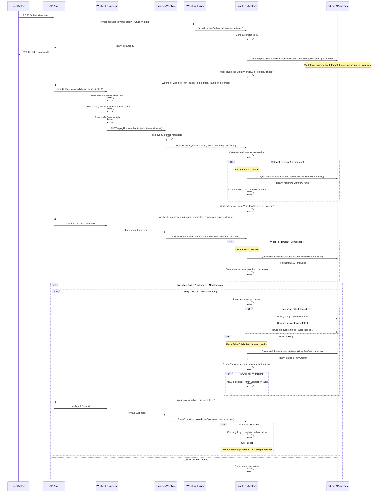

# Workflow Orchestration Setup

## Overview

This document provides setup instructions for integrating a GitHub App with the Azure-hosted API and Functions applications to enable automated GitHub workflow orchestration with retry logic.

For instructions on creating the GitHub App itself, see the [GitHub App Creation Guide](github-app-creation.md).

---

## Architecture

The following sequence diagram illustrates the complete workflow orchestration flow:



**Key Flow Points:**

1. **Initiation**: User triggers orchestration via API endpoint, which forwards to Functions Trigger using reverse proxy with Azure Managed Identity authentication
2. **Orchestration Start**: Trigger schedules new durable orchestration instance and returns instance ID immediately
3. **Dispatch**: Orchestrator dispatches GitHub workflow with unique workflow name: `{functionappidentifier}-{instanceId}` (e.g., `InternalApi-{instanceId}`)
4. **Event-Driven Tracking**: Orchestrator waits for external events (WorkflowInProgress, WorkflowCompleted) raised by webhook handler
5. **Webhook Processing**: 
   - GitHub sends webhooks to API at `/api/github/webhooks`
   - Webhook Processor validates HMAC-SHA256 signature using Octokit.Webhooks library
   - Processor validates repository, extracts instanceId from workflow name, and filters by `InternalApi` prefix
   - Valid webhooks are forwarded to Functions webhook endpoint with Azure MI authentication
6. **Event Raising**: Functions webhook handler raises external events to the orchestrator instance by instanceId
7. **Fallback Polling**: If webhook events timeout, orchestrator queries GitHub API directly to get workflow status
8. **Retry Logic**: On failure, orchestrator reruns failed jobs only (default) or entire workflow (if requested) up to MaxAttempts
9. **Retry Verification**: If rerun API call fails, orchestrator queries workflow run status and verifies RunAttempt number matches expected attempt to confirm rerun succeeded
10. **Authentication**: GitHub API calls use installation tokens obtained via JWT exchange with GitHub App credentials

---

## Prerequisites

Before setting up workflow orchestration, you must create and configure a GitHub App. Follow the step-by-step instructions in:

**[GitHub App Creation Guide](github-app-creation.md)**

You will need the following information from your GitHub App:
- App ID
- Installation ID
- Private Key (PEM file)
- Webhook Secret

---

## GitHub Workflow Requirements

Your GitHub Actions workflow file must meet specific requirements for the orchestration to work correctly.

### Required Trigger

The workflow **must** accept `workflow_dispatch` trigger with a `workflowName` input:

```yaml
on:
  workflow_dispatch:
    inputs:
      workflowName:
        description: 'Workflow name for tracking (format: functionappidentifier-instanceId)'
        required: true
        type: string
```

### Required Workflow Name Format

The workflow run name **must** use the workflowName input. This is how the system matches webhook events to orchestration instances:

```yaml
name: ${{ inputs.workflowName }}
```

**Actual Format:** The orchestrator generates workflow names in the format `{functionappidentifier}-{instanceId}`, where:
- `{functionappidentifier}` is the function app identifier prefix that identifies which function app will process the workflow
- `{instanceId}` is the unique orchestration instance ID used to track the workflow execution

Example: `InternalApi-abc123def456`

### Example Minimal Workflow Structure

Here's a complete minimal example:

```yaml
name: ${{ inputs.workflowName }}

on:
  workflow_dispatch:
    inputs:
      workflowName:
        description: 'Workflow name for tracking (format: functionappidentifier-instanceId)'
        required: true
        type: string

jobs:
  deploy:
    runs-on: ubuntu-latest
    steps:
      - name: Checkout code
        uses: actions/checkout@v4
      
      - name: Display workflow name
        run: echo "Processing with workflow name: ${{ inputs.workflowName }}"
      
      - name: Your deployment steps
        run: |
          # Add your actual deployment logic here
          echo "Deploying application..."
```

### Important Notes

- The workflow name format will be: `{functionappidentifier}-{instanceId}` (e.g., `InternalApi-abc123def456`)
- The function app identifier prefix is used to route the workflow to the correct function app
- The instanceId is used to track the specific orchestration instance
- The workflow name **must exactly match** the workflowName input for tracking to work
- You can add any additional workflow logic, jobs, and steps as needed
- The workflow can be triggered manually or via other triggers, but `workflow_dispatch` is required for orchestration
- **Rate Limiting**: The GitHub webhook endpoint is protected by rate limiting to prevent abuse:
  - Default: 100 requests per 60-second window
  - Configurable via `RateLimiting:GithubWebhook` section in API `appsettings.json`
  - Uses fixed window rate limiting with oldest-first queue processing

---

## Azure Configuration

### Configuration Structure

Both the API and Functions applications require the same `Github` configuration section in their `appsettings.json` files.

For detailed explanations of each configuration option and their XML documentation, see the [`GithubAppOptions` class](../src/Template.Shared/Github/GithubAppOptions.cs).

**Important:** When deploying to Azure, these configuration values must also be added to your `__app_deploy.yml` workflow file as environment variables or app settings to ensure they are properly configured during deployment.

#### API - appsettings.json

```json
{
  "Github": {
    "Owner": null,
    "Repo": null,
    "Branch": null,
    "AppId": null,
    "InstallationId": 0,
    "PrivateKeyPem": null,
    "WebhookSecret": null,
    "MaxAttempts": 5,
    "WorkflowTimeoutHours": 12
  }
}
```

#### Functions - appsettings.json

Same structure as API configuration above.

#### Rate Limiting Configuration (API only)

The API application includes rate limiting for the GitHub webhook endpoint to prevent abuse:

```json
{
  "RateLimiting": {
    "GithubWebhook": {
      "PermitLimit": 100,
      "WindowInSeconds": 60,
      "Enabled": true
    }
  }
}
```

**Configuration Parameters:**
- `PermitLimit`: Maximum number of requests allowed within the time window (default: 100)
- `WindowInSeconds`: Time window in seconds for the rate limit (default: 60, max: 3600)
- `Enabled`: Whether rate limiting is enabled (default: true, recommended to disable in development)

**Behavior:**
- Uses fixed window rate limiting algorithm
- Requests exceeding the limit receive HTTP 429 (Too Many Requests) response
- Queued requests are processed in oldest-first order
- No queue for rejected requests (QueueLimit: 0)

### Reverse Proxy Routing

The API application uses a reverse proxy pattern with Azure Managed Identity authentication to forward requests to the Functions app:

#### Workflow Start Flow
1. **User Request**: Client sends POST to `/api/workflow/start`
2. **API Proxy**: API forwards request to Functions using `FunctionAppHttpClient`
3. **Authentication**: Azure Managed Identity token added via `AzureIdentityAuthHttpClientHandler`
4. **Trigger**: Functions `GithubWorkflowTrigger` receives request and schedules orchestration
5. **Response**: Instance ID returned through the proxy chain back to user

#### Webhook Flow
1. **GitHub Webhook**: GitHub sends webhook events to `POST /api/github/webhooks`
2. **Octokit.Webhooks Validation**: ASP.NET Core middleware validates HMAC-SHA256 signature using webhook secret
3. **Processor Validation**: `WorkflowRunWebhookProcessor` deserializes and validates:
   - Event type must be `WorkflowRun`
   - Repository must match configured Owner/Repo
   - Workflow name must follow format: `{functionappidentifier}-{instanceId}`
   - Function app identifier prefix extracted to determine target function app
   - instanceId extracted from workflow name to track the orchestration instance
4. **Forwarding**: Valid webhooks forwarded to Functions at `/api/github/webhooks` using `FunctionAppHttpClient` with Azure MI token
5. **Event Raising**: Functions `GithubWebhook` handler parses event and raises external event to orchestrator instance
6. **Security**: Only validated, repository-matched, prefix-filtered webhooks reach the Functions orchestration logic

This approach uses:
- **Octokit.Webhooks.AspNetCore** for type-safe webhook processing and HMAC validation
- **Azure Managed Identity** for secure service-to-service authentication
- **Function app identifier** in workflow name format to route webhooks to the correct function app
- **instanceId** in workflow name format to track and correlate orchestration instances
- **Repository validation** to prevent webhooks from unauthorized repositories

---

## Retry Behavior and RerunEntireWorkflow Flag

### Understanding Retry Modes

When a GitHub workflow fails, the orchestrator can retry the workflow in two modes:

#### 1. Rerun Failed Jobs Only (Default)

**Default behavior** when `RerunEntireWorkflow` is `false` or omitted:

```json
{
  "WorkflowFile": "deploy.yaml"
}
```

- Only jobs that failed are re-executed
- Previously successful jobs are skipped
- **Faster retry** - saves time and resources
- **Use case**: Independent jobs where failures don't affect successful jobs

**Limitations:**
- **Not suitable for dependent jobs**: If a failed job depends on a previously successful job, the dependency won't be re-run
- Example: If `build` job passes and `deploy` job fails, retrying will skip `build` and only retry `deploy`, even though `deploy` depends on fresh build artifacts

#### 2. Rerun Entire Workflow

**Explicit behavior** when `RerunEntireWorkflow` is `true`:

```json
{
  "WorkflowFile": "deploy.yaml",
  "RerunEntireWorkflow": true
}
```

- All jobs are re-executed from scratch
- All previous job results are discarded
- **Longer retry time** - re-runs everything
- **Use case**: Jobs with dependencies or when you need a clean slate

**When to use:**
- **Dependent jobs**: When failed jobs depend on successful jobs (e.g., deploy depends on build)
- **State dependencies**: When jobs rely on artifacts, caches, or state from previous jobs
- **Auto-approve workflows**: When using environment auto-approval (see below)

### Auto-Approve Scenario

When using GitHub environment protection rules with auto-approval actions, **you must use `RerunEntireWorkflow: true`**:

**Why?** GitHub's auto-approval action (e.g., `activescott/automate-environment-deployment-approval`) runs as a separate job that approves deployment requests. If the deployment job fails and you retry with failed jobs only:
1. The auto-approve job is skipped (it succeeded previously)
2. The deployment job expects a new approval
3. **No approval is granted** → deployment hangs indefinitely

**Solution:** Set `RerunEntireWorkflow: true` to ensure the auto-approve job runs again on retry.

**Example workflow with auto-approval:**
```yaml
jobs:
  qa-auto-approve:
    runs-on: ubuntu-latest
    steps:
      - name: Wait for deployment to be registered
        run: sleep 20
      
      - name: Auto-approve deployment
        uses: activescott/automate-environment-deployment-approval@10179fc61443cb28b95e807814d9dfce60a9e230
        with:
          github_token: ${{ secrets.AUTO_APPROVE_DEPLOYMENTS_TOKEN }}
          environment_allow_list: qa
          run_id_allow_list: ${{ github.run_id }}
  
  qa-deploy:
    runs-on: ubuntu-latest
    environment:
      name: qa
    needs: qa-auto-approve  # Depends on auto-approve
    steps:
      - name: Deploy to QA
        run: echo "Deploying..."
```

For this workflow, use:
```bash
curl -X POST https://<your-api-domain>/api/workflow/start \
  -H "Authorization: Bearer <your-token>" \
  -H "Content-Type: application/json" \
  -d '{"WorkflowFile": "deploy.yaml", "RerunEntireWorkflow": true}'
```

---

## Restricting Workflows to Specific Environments

### GitHub App Authorization per Environment

The `validate-github-app-actor` action restricts workflow jobs to run only when triggered by the authorized GitHub App for that environment.

### How It Works

Each environment (dev, qa, staging, prod, etc.) can be configured with a specific GitHub App ID and slug in your infrastructure conventions. The action validates that the workflow actor (the GitHub App that triggered the workflow) matches the expected app for each environment.

### Setup

#### 1. Configure GitHub App per Environment

In your infrastructure conventions (e.g., `tools/infrastructure/get-product-conventions.ps1`), set the GitHub App details for each environment:

```json
{
  "SubProducts": {
    "Github": {
      "AppSlug": "my-app-dev",
      "AppId": "123456"
    }
  }
}
```

#### 2. Add Authorization Check Job

Add a job that checks authorization for all environments:

```yaml
jobs:
  check-authorization:
    runs-on: ubuntu-latest
    outputs:
      dev: ${{ steps.auth.outputs.dev }}
      qa: ${{ steps.auth.outputs.qa }}
      staging: ${{ steps.auth.outputs.staging }}
      prod-na: ${{ steps.auth.outputs.prod-na }}
      # Add other environments as needed
    steps:
      - uses: actions/checkout@v4
      - id: auth
        uses: ./.github/actions/validate-github-app-actor
```

#### 3. Conditionally Run Environment Jobs

Use the authorization outputs to control which environment jobs run:

```yaml
  dev-deploy:
    runs-on: ubuntu-latest
    needs: check-authorization
    if: needs.check-authorization.outputs.dev == 'true'
    environment:
      name: dev
    steps:
      - name: Deploy to Dev
        run: echo "Deploying to dev environment"
```

### Security Benefits

1. **Environment Isolation**: Each environment can only be deployed to by its authorized GitHub App
2. **Prevents Cross-Environment Contamination**: A dev GitHub App cannot deploy to production
3. **Audit Trail**: GitHub shows which app triggered each workflow run
4. **Multi-Tenancy Support**: Different teams/environments can use different GitHub Apps

### Example: Complete Workflow

```yaml
name: ${{ inputs.workflowName }}

on:
  workflow_dispatch:
    inputs:
      workflowName:
        description: 'Workflow name for tracking (format: functionappidentifier-instanceId)'
        required: true
        type: string

run-name: ${{ inputs.workflowName }}

jobs:
  check-authorization:
    runs-on: ubuntu-latest
    outputs:
      dev: ${{ steps.auth.outputs.dev }}
      qa: ${{ steps.auth.outputs.qa }}
      prod-na: ${{ steps.auth.outputs.prod-na }}
    steps:
      - uses: actions/checkout@v4
      - id: auth
        uses: ./.github/actions/validate-github-app-actor

  dev-deploy:
    runs-on: ubuntu-latest
    needs: check-authorization
    if: needs.check-authorization.outputs.dev == 'true'
    environment:
      name: dev
    steps:
      - uses: actions/checkout@v4
      - name: Deploy to Dev
        run: |
          echo "Deploying to dev with workflow name: ${{ inputs.workflowName }}"
          # Your deployment logic here

  qa-auto-approve:
    runs-on: ubuntu-latest
    needs: check-authorization
    if: needs.check-authorization.outputs.qa == 'true'
    steps:
      - name: Wait for deployment to be registered
        run: sleep 20
      - name: Auto-approve deployment
        uses: activescott/automate-environment-deployment-approval@10179fc61443cb28b95e807814d9dfce60a9e230
        with:
          github_token: ${{ secrets.AUTO_APPROVE_DEPLOYMENTS_TOKEN }}
          environment_allow_list: qa
          run_id_allow_list: ${{ github.run_id }}

  qa-deploy:
    runs-on: ubuntu-latest
    needs: 
      - check-authorization
      - qa-auto-approve
    if: needs.check-authorization.outputs.qa == 'true'
    environment:
      name: qa
    steps:
      - uses: actions/checkout@v4
      - name: Deploy to QA
        run: |
          echo "Deploying to QA with workflow name: ${{ inputs.workflowName }}"
          # Your deployment logic here

  prod-deploy:
    runs-on: ubuntu-latest
    needs: check-authorization
    if: needs.check-authorization.outputs.prod-na == 'true'
    environment:
      name: prod-na
    steps:
      - uses: actions/checkout@v4
      - name: Deploy to Production
        run: |
          echo "Deploying to production with workflow name: ${{ inputs.workflowName }}"
          # Your deployment logic here
```

**Important:** For workflows with auto-approval, remember to use `RerunEntireWorkflow: true` when triggering via the API.

---

## Testing and Verification

### Trigger a Workflow

Use the Postman collection located at `tests/postman/api.postman_collection.json` to trigger workflows. The collection already includes the necessary authentication and endpoint configuration.

**Request:** `Proxied > Trigger Workflow`

**Request Body Examples:**

```json
// Basic - reruns only failed jobs
{
  "WorkflowFile": "deploy.yaml"
}

// Rerun entire workflow on failure
{
  "WorkflowFile": "deploy.yaml",
  "RerunEntireWorkflow": true
}
```

**Expected Response:**
```json
{
  "Id": "instanceId"
}
```

**What happens next:**
- Orchestration instance is created in Durable Functions with specified workflow file
- GitHub workflow is dispatched with workflowName: `{functionappidentifier}-{instanceId}` (e.g., `InternalApi-abc123def456`)
- The function app identifier determines which function app processes the workflow
- The instanceId is used to track and correlate webhook events to the orchestration
- Orchestration waits for webhook events from GitHub
- If webhook event doesn't arrive in time, orchestrator queries GitHub for recent workflow runs

**Track the workflow execution:**
- Use the [Durable Function Monitoring tool](durable-function-monitoring.md) to track the orchestration progress in real-time
- Monitor the workflow status, steps, and any retry attempts through the Durable Functions Monitor UI

### Verify Workflow Execution

1. **Navigate to GitHub repository**
   - Go to **Actions** tab
   - You should see a new workflow run

2. **Check workflow details**
   - Workflow run name should be: `{functionappidentifier}-{instanceId}` (e.g., `InternalApi-abc123def456`)
   - Status should show as "In progress" or "Completed"
   - Inputs should show workflowName matching the format

3. **Verify workflow logs**
   - Click into the workflow run
   - Check job logs to ensure steps are executing correctly

### Validate Webhook Delivery

1. **Navigate to GitHub App settings**
   - Settings → Developer settings → GitHub Apps → Your App

2. **Check recent deliveries**
   - Click **Advanced** tab
   - View **Recent Deliveries**
   - Look for deliveries with green checkmarks (successful)

3. **Inspect delivery details**
   - Click on a delivery to see request/response details
   - Response status should be **200 OK**
   - Response headers should show successful processing

4. **Common webhook events to verify**
   - `workflow_run` with action: `in_progress` (when workflow starts)
   - `workflow_run` with action: `completed` (when workflow finishes)

## Security Considerations

### Critical Security Practices

**Store private keys ONLY in secure vaults** such as Azure Key Vault or HashiCorp Vault. Never store private keys in:
- Source control (Git repositories)
- Plain text configuration files
- Environment variables in shared environments
- Build/deployment logs

### Webhook Security

- **HMAC-SHA256 Validation**: All webhook requests are validated using Octokit.Webhooks library before processing
- **Repository Validation**: Webhook processor verifies the webhook originates from the configured repository (Owner/Repo match)
- **Workflow Name Format Validation**: Workflow names must follow `{functionappidentifier}-{instanceId}` format for processing
- **Function App Routing**: Function app identifier in workflow name determines which function app processes the webhook
- **Azure Managed Identity**: Service-to-service authentication between API and Functions using Azure MI tokens
- **instanceId Extraction**: Orchestrator instanceId is extracted from the workflow name, ensuring events route to correct orchestration
- **Type-Safe Deserialization**: Octokit.Webhooks provides strongly-typed payload deserialization with validation
- **Rate Limiting**: Webhook endpoint is protected by rate limiting (100 requests per 60 seconds by default)
- **Endpoint Isolation**: Functions webhook endpoint is never exposed publicly; only accessible via authenticated API proxy


---

## Additional Resources

### GitHub Documentation
- [GitHub Apps Documentation](https://docs.github.com/en/apps)
- [Webhook Events and Payloads](https://docs.github.com/en/webhooks/webhook-events-and-payloads)
- [Authenticating with GitHub Apps](https://docs.github.com/en/apps/creating-github-apps/authenticating-with-a-github-app)
---
