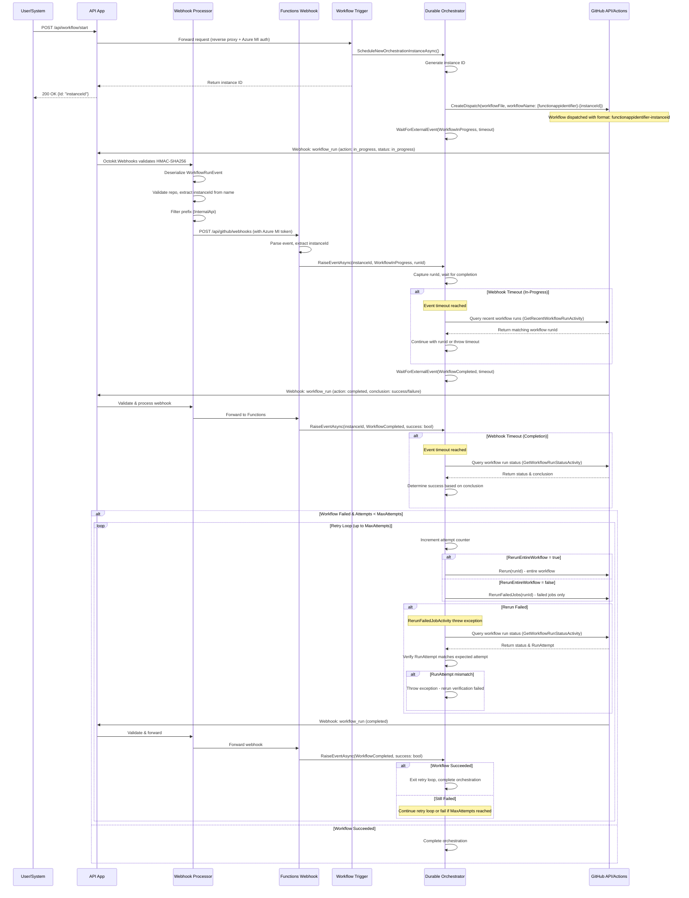

# Workflow Orchestration Setup

## Overview

This document provides setup instructions for integrating a GitHub App with the Azure-hosted API and Functions applications to enable automated GitHub workflow orchestration with retry logic.

For instructions on creating the GitHub App itself, see the [GitHub App Creation Guide](github-app-creation.md).

---

## Architecture

The following sequence diagram illustrates the complete workflow orchestration flow:


```mermaid
sequenceDiagram
    participant User as User/System
    participant API as API App
    participant Processor as Webhook Processor
    participant FunctionsAPI as Functions Webhook
    participant Trigger as Workflow Trigger
    participant Orchestrator as Durable Orchestrator
    participant GitHub as GitHub API/Actions

    User->>API: POST /api/workflow/start 
    API->>Trigger: Forward request (reverse proxy + Azure MI auth)
    Trigger->>Orchestrator: ScheduleNewOrchestrationInstanceAsync()
    Orchestrator->>Orchestrator: Generate instance ID
    Trigger-->>API: Return instance ID
    API-->>User: 200 OK {Id: "instanceId"}
    
    Orchestrator->>GitHub: CreateDispatch(workflowFile, workflowName: {functionappidentifier}-{instanceId})
    Note over GitHub: Workflow dispatched with format: functionappidentifier-instanceid
    
    Orchestrator->>Orchestrator: WaitForExternalEvent(WorkflowInProgress, timeout)
    
    GitHub->>API: Webhook: workflow_run (action: in_progress, status: in_progress)
    API->>Processor: Octokit.Webhooks validates HMAC-SHA256
    Processor->>Processor: Deserialize WorkflowRunEvent
    Processor->>Processor: Validate repo, extract instanceId from name
    Processor->>Processor: Filter prefix (InternalApi)
    Processor->>FunctionsAPI: POST /api/github/webhooks (with Azure MI token)
    FunctionsAPI->>FunctionsAPI: Parse event, extract instanceId
    FunctionsAPI->>Orchestrator: RaiseEventAsync(instanceId, WorkflowInProgress, runId)
    Orchestrator->>Orchestrator: Capture runId, wait for completion
    
    alt Webhook Timeout (In-Progress)
        Note over Orchestrator: Event timeout reached
        Orchestrator->>GitHub: Query recent workflow runs (GetRecentWorkflowRunActivity)
        GitHub-->>Orchestrator: Return matching workflow runId
        Orchestrator->>Orchestrator: Continue with runId or throw timeout
    end
    
    Orchestrator->>Orchestrator: WaitForExternalEvent(WorkflowCompleted, timeout)
    
    GitHub->>API: Webhook: workflow_run (action: completed, conclusion: success/failure)
    API->>Processor: Validate & process webhook
    Processor->>FunctionsAPI: Forward to Functions
    FunctionsAPI->>Orchestrator: RaiseEventAsync(instanceId, WorkflowCompleted, success: bool)
    
    alt Webhook Timeout (Completion)
        Note over Orchestrator: Event timeout reached
        Orchestrator->>GitHub: Query workflow run status (GetWorkflowRunStatusActivity)
        GitHub-->>Orchestrator: Return status & conclusion
        Orchestrator->>Orchestrator: Determine success based on conclusion
    end
    
    alt Workflow Failed & Attempts < MaxAttempts
        loop Retry Loop (up to MaxAttempts)
            Orchestrator->>Orchestrator: Increment attempt counter
            alt RerunEntireWorkflow = true
                Orchestrator->>GitHub: Rerun(runId) - entire workflow
            else RerunEntireWorkflow = false
                Orchestrator->>GitHub: RerunFailedJobs(runId) - failed jobs only
            end
            
            alt Rerun Failed
                Note over Orchestrator: RerunFailedJobActivity threw exception
                Orchestrator->>GitHub: Query workflow run status (GetWorkflowRunStatusActivity)
                GitHub-->>Orchestrator: Return status & RunAttempt
                Orchestrator->>Orchestrator: Verify RunAttempt matches expected attempt
                alt RunAttempt mismatch
                    Orchestrator->>Orchestrator: Throw exception - rerun verification failed
                end
            end
            
            GitHub->>API: Webhook: workflow_run (completed)
            API->>Processor: Validate & forward
            Processor->>FunctionsAPI: Forward webhook
            FunctionsAPI->>Orchestrator: RaiseEventAsync(WorkflowCompleted, success: bool)
            
            alt Workflow Succeeded
                Orchestrator->>Orchestrator: Exit retry loop, complete orchestration
            else Still Failed
                Note over Orchestrator: Continue retry loop or fail if MaxAttempts reached
            end
        end
    else Workflow Succeeded
        Orchestrator->>Orchestrator: Complete orchestration
    end
```

**Key Flow Points:**

1. **Initiation**: User triggers orchestration via API endpoint, which forwards to Functions Trigger using reverse proxy with Azure Managed Identity authentication
2. **Orchestration Start**: Trigger schedules new durable orchestration instance and returns instance ID immediately
3. **Dispatch**: Orchestrator dispatches GitHub workflow with unique workflow name: `{functionappidentifier}-{instanceId}` (e.g., `InternalApi-{instanceId}`)
4. **Event-Driven Tracking**: Orchestrator waits for external events (WorkflowInProgress, WorkflowCompleted) raised by webhook handler
5. **Webhook Processing**: 
   - GitHub sends webhooks to API at `/api/github/webhooks`
   - Webhook Processor validates HMAC-SHA256 signature using Octokit.Webhooks library
   - Processor validates repository, extracts instanceId from workflow name, and filters by `InternalApi` prefix
   - Valid webhooks are forwarded to Functions webhook endpoint with Azure MI authentication
6. **Event Raising**: Functions webhook handler raises external events to the orchestrator instance by instanceId
7. **Fallback Polling**: If webhook events timeout, orchestrator queries GitHub API directly to get workflow status
8. **Retry Logic**: On failure, orchestrator reruns failed jobs only (default) or entire workflow (if requested) up to MaxAttempts
9. **Retry Verification**: If rerun API call fails, orchestrator queries workflow run status and verifies RunAttempt number matches expected attempt to confirm rerun succeeded
10. **Authentication**: GitHub API calls use installation tokens obtained via JWT exchange with GitHub App credentials

---

## Prerequisites

Before setting up workflow orchestration, you must create and configure a GitHub App. Follow the step-by-step instructions in:

**[GitHub App Creation Guide](github-app-creation.md)**

You will need the following information from your GitHub App:
- App ID
- Installation ID
- Private Key (PEM file)
- Webhook Secret

---

## GitHub Workflow Requirements

Your GitHub Actions workflow file must meet specific requirements for the orchestration to work correctly.

### Required Trigger

The workflow **must** accept `workflow_dispatch` trigger with a `workflowName` input:

```yaml
on:
  workflow_dispatch:
    inputs:
      workflowName:
        description: 'Workflow name for tracking (format: functionappidentifier-instanceId)'
        required: true
        type: string
```

### Required Workflow Name Format

The workflow run name **must** use the workflowName input. This is how the system matches webhook events to orchestration instances:

```yaml
name: ${{ inputs.workflowName }}
```

**Actual Format:** The orchestrator generates workflow names in the format `{functionappidentifier}-{instanceId}`, where:
- `{functionappidentifier}` is the function app identifier prefix that identifies which function app will process the workflow
- `{instanceId}` is the unique orchestration instance ID used to track the workflow execution

Example: `InternalApi-abc123def456`

### Example Minimal Workflow Structure

Here's a complete minimal example:

```yaml
name: ${{ inputs.workflowName }}

on:
  workflow_dispatch:
    inputs:
      workflowName:
        description: 'Workflow name for tracking (format: functionappidentifier-instanceId)'
        required: true
        type: string

jobs:
  deploy:
    runs-on: ubuntu-latest
    steps:
      - name: Checkout code
        uses: actions/checkout@v4
      
      - name: Display workflow name
        run: echo "Processing with workflow name: ${{ inputs.workflowName }}"
      
      - name: Your deployment steps
        run: |
          # Add your actual deployment logic here
          echo "Deploying application..."
```

### Important Notes

- The workflow name format will be: `{functionappidentifier}-{instanceId}` (e.g., `InternalApi-abc123def456`)
- The function app identifier prefix is used to route the workflow to the correct function app
- The instanceId is used to track the specific orchestration instance
- The workflow name **must exactly match** the workflowName input for tracking to work
- You can add any additional workflow logic, jobs, and steps as needed
- The workflow can be triggered manually or via other triggers, but `workflow_dispatch` is required for orchestration
- **Rate Limiting**: The GitHub webhook endpoint is protected by rate limiting to prevent abuse:
  - Default: 100 requests per 1-minute window
  - Configurable via `RateLimiting:GithubWebhook` section in API `appsettings.json`
  - Uses fixed window rate limiting (excess requests are rejected immediately by default)

---

## Azure Configuration

### Configuration Structure

Both the API and Functions applications require the same `Github` configuration section in their `appsettings.json` files.

For detailed explanations of each configuration option and their XML documentation, see the [`GithubAppOptions` class](../src/Template.Shared/Github/GithubAppOptions.cs).

**Important:** When deploying to Azure, these configuration values must also be added to your `__app_deploy.yml` workflow file as environment variables or app settings to ensure they are properly configured during deployment.

#### API - appsettings.json

```json
{
  "Github": {
    "Owner": null,
    "Repo": null,
    "Branch": null,
    "AppId": null,
    "InstallationId": 0,
    "PrivateKeyPem": null,
    "WebhookSecret": null,
    "MaxAttempts": 5,
    "WorkflowTimeoutHours": 12
  }
}
```

#### Functions - appsettings.json

Same structure as API configuration above.

#### Rate Limiting Configuration (API only)

The API application includes rate limiting for the GitHub webhook endpoint to prevent abuse:

```json
{
  "RateLimiting": {
    "GithubWebhook": {
      "PermitLimit": 100,
      "Window": "00:01:00",
      "QueueProcessingOrder": "OldestFirst",
      "QueueLimit": 0
    }
  }
}
```

**Configuration Parameters:**
- `PermitLimit`: Maximum number of requests allowed within the time window (default: 100)
- `Window`: Time window for the rate limit as a TimeSpan (default: "00:01:00" for 1 minute, supports standard TimeSpan format like "00:00:30" for 30 seconds or "01:00:00" for 1 hour)
- `QueueProcessingOrder`: Order in which queued requests are processed (default: "OldestFirst", alternative: "NewestFirst")
- `QueueLimit`: Maximum number of requests that can be queued when limit is reached (default: 0, meaning no queueing - requests are rejected immediately)

**Behavior:**
- Uses fixed window rate limiting algorithm (FixedWindowRateLimiterOptions)
- Requests exceeding the limit receive HTTP 429 (Too Many Requests) response
- With `QueueLimit: 0`, no requests are queued - all excess requests are rejected immediately
- If `QueueLimit` is increased, queued requests are processed according to `QueueProcessingOrder`

### Reverse Proxy Routing

The API application uses a reverse proxy pattern with Azure Managed Identity authentication to forward requests to the Functions app:

#### Workflow Start Flow
1. **User Request**: Client sends POST to `/api/workflow/start`
2. **API Proxy**: API forwards request to Functions using `FunctionAppHttpClient`
3. **Authentication**: Azure Managed Identity token added via `AzureIdentityAuthHttpClientHandler`
4. **Trigger**: Functions `GithubWorkflowTrigger` receives request and schedules orchestration
5. **Response**: Instance ID returned through the proxy chain back to user

#### Webhook Flow
1. **GitHub Webhook**: GitHub sends webhook events to `POST /api/github/webhooks`
2. **Octokit.Webhooks Validation**: ASP.NET Core middleware validates HMAC-SHA256 signature using webhook secret
3. **Processor Validation**: `WorkflowRunWebhookProcessor` deserializes and validates:
   - Event type must be `WorkflowRun`
   - Repository must match configured Owner/Repo
   - Workflow name must follow format: `{functionappidentifier}-{instanceId}`
   - Function app identifier prefix extracted to determine target function app
   - instanceId extracted from workflow name to track the orchestration instance
4. **Forwarding**: Valid webhooks forwarded to Functions at `/api/github/webhooks` using `FunctionAppHttpClient` with Azure MI token
5. **Event Raising**: Functions `GithubWebhook` handler parses event and raises external event to orchestrator instance
6. **Security**: Only validated, repository-matched, prefix-filtered webhooks reach the Functions orchestration logic

This approach uses:
- **Octokit.Webhooks.AspNetCore** for type-safe webhook processing and HMAC validation
- **Azure Managed Identity** for secure service-to-service authentication
- **Function app identifier** in workflow name format to route webhooks to the correct function app
- **instanceId** in workflow name format to track and correlate orchestration instances
- **Repository validation** to prevent webhooks from unauthorized repositories

---

## Retry Behavior and RerunEntireWorkflow Flag

### Understanding Retry Modes

When a GitHub workflow fails, the orchestrator can retry the workflow in two modes:

#### 1. Rerun Failed Jobs Only (Default)

**Default behavior** when `RerunEntireWorkflow` is `false` or omitted:

```json
{
  "WorkflowFile": "deploy.yaml"
}
```

- Only jobs that failed are re-executed
- Previously successful jobs are skipped
- **Faster retry** - saves time and resources
- **Use case**: Independent jobs where failures don't affect successful jobs

**Limitations:**
- **Not suitable for dependent jobs**: If a failed job depends on a previously successful job, the dependency won't be re-run
- Example: If `build` job passes and `deploy` job fails, retrying will skip `build` and only retry `deploy`, even though `deploy` depends on fresh build artifacts

#### 2. Rerun Entire Workflow

**Explicit behavior** when `RerunEntireWorkflow` is `true`:

```json
{
  "WorkflowFile": "deploy.yaml",
  "RerunEntireWorkflow": true
}
```

- All jobs are re-executed from scratch
- All previous job results are discarded
- **Longer retry time** - re-runs everything
- **Use case**: Jobs with dependencies or when you need a clean slate

**When to use:**
- **Dependent jobs**: When failed jobs depend on successful jobs (e.g., deploy depends on build)
- **State dependencies**: When jobs rely on artifacts, caches, or state from previous jobs
- **Auto-approve workflows**: When using environment auto-approval (see below)

### Auto-Approve Scenario

When using GitHub environment protection rules with auto-approval actions, **you must use `RerunEntireWorkflow: true`**:

**Why?** GitHub's auto-approval action (e.g., `activescott/automate-environment-deployment-approval`) runs as a separate job that approves deployment requests. If the deployment job fails and you retry with failed jobs only:
1. The auto-approve job is skipped (it succeeded previously)
2. The deployment job expects a new approval
3. **No approval is granted** → deployment hangs indefinitely

**Solution:** Set `RerunEntireWorkflow: true` to ensure the auto-approve job runs again on retry.

**Example workflow with auto-approval:**
```yaml
jobs:
  qa-auto-approve:
    runs-on: ubuntu-latest
    steps:
      - name: Wait for deployment to be registered
        run: sleep 20
      
      - name: Auto-approve deployment
        uses: activescott/automate-environment-deployment-approval@10179fc61443cb28b95e807814d9dfce60a9e230
        with:
          github_token: ${{ secrets.AUTO_APPROVE_DEPLOYMENTS_TOKEN }}
          environment_allow_list: qa
          run_id_allow_list: ${{ github.run_id }}
  
  qa-deploy:
    runs-on: ubuntu-latest
    environment:
      name: qa
    needs: qa-auto-approve  # Depends on auto-approve
    steps:
      - name: Deploy to QA
        run: echo "Deploying..."
```

For this workflow, use:
```bash
curl -X POST https://<your-api-domain>/api/workflow/start \
  -H "Authorization: Bearer <your-token>" \
  -H "Content-Type: application/json" \
  -d '{"WorkflowFile": "deploy.yaml", "RerunEntireWorkflow": true}'
```

---

## Restricting Workflows to Specific Environments

### GitHub App Authorization per Environment

The `validate-github-app-actor` action restricts workflow jobs to run only when triggered by the authorized GitHub App for that environment.

### How It Works

Each environment (dev, qa, staging, prod, etc.) can be configured with a specific GitHub App ID and slug in your infrastructure conventions. The action validates that the workflow actor (the GitHub App that triggered the workflow) matches the expected app for each environment.

### Setup

#### 1. Configure GitHub App per Environment

In your infrastructure conventions (e.g., `tools/infrastructure/get-product-conventions.ps1`), set the GitHub App details for each environment:

```json
{
  "SubProducts": {
    "Github": {
      "AppSlug": "my-app-dev",
      "AppId": "123456"
    }
  }
}
```

#### 2. Add Authorization Check Job

Add a job that checks authorization for all environments:

```yaml
jobs:
  check-authorization:
    runs-on: ubuntu-latest
    outputs:
      dev: ${{ steps.auth.outputs.dev }}
      qa: ${{ steps.auth.outputs.qa }}
      staging: ${{ steps.auth.outputs.staging }}
      prod-na: ${{ steps.auth.outputs.prod-na }}
      # Add other environments as needed
    steps:
      - uses: actions/checkout@v4
      - id: auth
        uses: ./.github/actions/validate-github-app-actor
```

#### 3. Conditionally Run Environment Jobs

Use the authorization outputs to control which environment jobs run:

```yaml
  dev-deploy:
    runs-on: ubuntu-latest
    needs: check-authorization
    if: needs.check-authorization.outputs.dev == 'true'
    environment:
      name: dev
    steps:
      - name: Deploy to Dev
        run: echo "Deploying to dev environment"
```

### Security Benefits

1. **Environment Isolation**: Each environment can only be deployed to by its authorized GitHub App
2. **Prevents Cross-Environment Contamination**: A dev GitHub App cannot deploy to production
3. **Audit Trail**: GitHub shows which app triggered each workflow run
4. **Multi-Tenancy Support**: Different teams/environments can use different GitHub Apps

### Example: Complete Workflow

```yaml
name: ${{ inputs.workflowName }}

on:
  workflow_dispatch:
    inputs:
      workflowName:
        description: 'Workflow name for tracking (format: functionappidentifier-instanceId)'
        required: true
        type: string

run-name: ${{ inputs.workflowName }}

jobs:
  check-authorization:
    runs-on: ubuntu-latest
    outputs:
      dev: ${{ steps.auth.outputs.dev }}
      qa: ${{ steps.auth.outputs.qa }}
      prod-na: ${{ steps.auth.outputs.prod-na }}
    steps:
      - uses: actions/checkout@v4
      - id: auth
        uses: ./.github/actions/validate-github-app-actor

  dev-deploy:
    runs-on: ubuntu-latest
    needs: check-authorization
    if: needs.check-authorization.outputs.dev == 'true'
    environment:
      name: dev
    steps:
      - uses: actions/checkout@v4
      - name: Deploy to Dev
        run: |
          echo "Deploying to dev with workflow name: ${{ inputs.workflowName }}"
          # Your deployment logic here

  qa-auto-approve:
    runs-on: ubuntu-latest
    needs: check-authorization
    if: needs.check-authorization.outputs.qa == 'true'
    steps:
      - name: Wait for deployment to be registered
        run: sleep 20
      - name: Auto-approve deployment
        uses: activescott/automate-environment-deployment-approval@10179fc61443cb28b95e807814d9dfce60a9e230
        with:
          github_token: ${{ secrets.AUTO_APPROVE_DEPLOYMENTS_TOKEN }}
          environment_allow_list: qa
          run_id_allow_list: ${{ github.run_id }}

  qa-deploy:
    runs-on: ubuntu-latest
    needs: 
      - check-authorization
      - qa-auto-approve
    if: needs.check-authorization.outputs.qa == 'true'
    environment:
      name: qa
    steps:
      - uses: actions/checkout@v4
      - name: Deploy to QA
        run: |
          echo "Deploying to QA with workflow name: ${{ inputs.workflowName }}"
          # Your deployment logic here

  prod-deploy:
    runs-on: ubuntu-latest
    needs: check-authorization
    if: needs.check-authorization.outputs.prod-na == 'true'
    environment:
      name: prod-na
    steps:
      - uses: actions/checkout@v4
      - name: Deploy to Production
        run: |
          echo "Deploying to production with workflow name: ${{ inputs.workflowName }}"
          # Your deployment logic here
```

**Important:** For workflows with auto-approval, remember to use `RerunEntireWorkflow: true` when triggering via the API.

---

## Testing and Verification

### Trigger a Workflow

Use the Postman collection located at `tests/postman/api.postman_collection.json` to trigger workflows. The collection already includes the necessary authentication and endpoint configuration.

**Request:** `Proxied > Trigger Workflow`

**Request Body Examples:**

```json
// Basic - reruns only failed jobs
{
  "WorkflowFile": "deploy.yaml"
}

// Rerun entire workflow on failure
{
  "WorkflowFile": "deploy.yaml",
  "RerunEntireWorkflow": true
}
```

**Expected Response:**
```json
{
  "Id": "instanceId"
}
```

**What happens next:**
- Orchestration instance is created in Durable Functions with specified workflow file
- GitHub workflow is dispatched with workflowName: `{functionappidentifier}-{instanceId}` (e.g., `InternalApi-abc123def456`)
- The function app identifier determines which function app processes the workflow
- The instanceId is used to track and correlate webhook events to the orchestration
- Orchestration waits for webhook events from GitHub
- If webhook event doesn't arrive in time, orchestrator queries GitHub for recent workflow runs

**Track the workflow execution:**
- Use the [Durable Function Monitoring tool](durable-function-monitoring.md) to track the orchestration progress in real-time
- Monitor the workflow status, steps, and any retry attempts through the Durable Functions Monitor UI

### Verify Workflow Execution

1. **Navigate to GitHub repository**
   - Go to **Actions** tab
   - You should see a new workflow run

2. **Check workflow details**
   - Workflow run name should be: `{functionappidentifier}-{instanceId}` (e.g., `InternalApi-abc123def456`)
   - Status should show as "In progress" or "Completed"
   - Inputs should show workflowName matching the format

3. **Verify workflow logs**
   - Click into the workflow run
   - Check job logs to ensure steps are executing correctly

### Validate Webhook Delivery

1. **Navigate to GitHub App settings**
   - Settings → Developer settings → GitHub Apps → Your App

2. **Check recent deliveries**
   - Click **Advanced** tab
   - View **Recent Deliveries**
   - Look for deliveries with green checkmarks (successful)

3. **Inspect delivery details**
   - Click on a delivery to see request/response details
   - Response status should be **200 OK**
   - Response headers should show successful processing

4. **Common webhook events to verify**
   - `workflow_run` with action: `in_progress` (when workflow starts)
   - `workflow_run` with action: `completed` (when workflow finishes)

### Exact Local E2E Validation Procedure

Use this procedure to validate the queue-callback path end to end from a local machine. This procedure is intentionally terminal-first and is written so that either a human or a coding agent can run it step by step without needing to infer missing commands.

This procedure validates the following path:

1. local Functions receives `POST /api/workflow/start` on `GithubWorkflowTrigger`
2. local Functions dispatches the target GitHub Actions workflow on the configured branch
3. GitHub Actions publishes `GithubWorkflowInProgress` and `GithubWorkflowCompleted` back through the `localVerification` seam
4. the messages arrive in local Azurite through the dev tunnel queue endpoint
5. the local Durable orchestration reaches the expected terminal state for the returned `instanceId`

#### Validation Prerequisites

Before running the commands below, make sure all of the following are true:

1. You have already completed the local setup in [Local dev setup](./dev-setup.md) for the Functions app, Azurite, and Azure login.
2. The branch you currently have checked out locally has been pushed to GitHub.
3. If you want GitHub Actions to execute `master`, check out `master` locally before running the procedure.
4. You have GitHub CLI installed and authenticated.

If GitHub CLI is not installed, install it first:

```pwsh
brew install gh
gh auth login
```

#### Terminal Conventions

Run the commands below from the repository root.

The command blocks are written for PowerShell and are intended to be pasted directly into a PowerShell terminal.

If your active terminal is not PowerShell, open a PowerShell terminal first. Only use `pwsh -File` for checked-in `.ps1` scripts.

> Agent note:
> If you are running this procedure from a coding agent or from a non-PowerShell shell, do not collapse these multi-line blocks into quoted `pwsh -Command "..."` one-liners. That is the fastest way to break variable expansion, quoting, and JSON handling.

To keep GitHub CLI output non-interactive during this procedure, disable paging in Terminal D before you run any `gh` commands:

```pwsh
$env:GH_PAGER = 'cat'
```

Use four terminals:

1. Terminal A: Azurite
2. Terminal B: dev tunnel host
3. Terminal C: Functions app
4. Terminal D: validation commands

#### Step 1: Set validation variables

In Terminal D, set the variables for the run you want to validate.

Replace the placeholder values before running the block.

`$WorkflowBranch` is derived from the branch currently checked out in your local git working tree so that the validation uses the same branch without requiring any manual branch selection.

`$TunnelId` is the id of the persistent dev tunnel you already created for yourself by following [Microsoft dev tunnels for local services](./dev-tunnels.md). Use that existing tunnel id here.

```pwsh
$WorkflowBranch = (git rev-parse --abbrev-ref HEAD).Trim()
$TunnelId = '<your-dev-tunnel-id>'
$QueueTunnelBaseUrl = 'https://<your-dev-tunnel-host>/devstoreaccount1'
$WorkflowFile = 'webhook-integration-test.yml'
$FunctionsBaseUrl = 'http://localhost:7071'
$RepoRoot = (Get-Location).Path
$TmpDir = Join-Path $RepoRoot 'tmp'
$FunctionsLog = Join-Path $TmpDir 'local-workflow-functions.log'
$DurableInstancesLog = Join-Path $TmpDir 'local-workflow-durable-instances.json'
$DurableHistoryLog = Join-Path $TmpDir 'local-workflow-durable-history.json'
$RunListLog = Join-Path $TmpDir 'local-workflow-gh-run-list.json'
$RunLog = Join-Path $TmpDir 'local-workflow-gh-run.json'

if ([string]::IsNullOrWhiteSpace($WorkflowBranch)) {
  throw 'Failed to determine the current git branch.'
}

New-Item -ItemType Directory -Path $TmpDir -Force | Out-Null
Remove-Item $FunctionsLog, $DurableInstancesLog, $DurableHistoryLog, $RunListLog, $RunLog -Force -ErrorAction SilentlyContinue

Write-Host "WorkflowBranch: $WorkflowBranch"
```

> Agent note:
> Keep the first non-empty `instanceId` returned by Step 7 as the validation target unless Step 7 itself fails before returning an id.
>
> Do not start a second orchestration instance just because a later lookup command needs adjustment. Fix the lookup against the original `instanceId` first.
>
> If you do abandon an instance and start over, explicitly record the abandoned `instanceId` and why it was abandoned before proceeding.

#### Step 2: Restore tools and sign in

In Terminal D, run:

```pwsh
az login --tenant <your-tenant-id> --allow-no-subscriptions
dotnet restore --interactive
dotnet tool restore
devtunnel user login
gh auth status
```

Keep `devtunnel user login` as the default because it is the normal interactive sign-in path. If browser-based sign-in is unavailable in your environment, use the dev tunnel device-flow variant instead (`-d`). Either way, this remains a user-authentication prerequisite, not a fully unattended agent step.

#### Step 3: Apply the local validation overrides

In Terminal D, run:

```pwsh
dotnet user-secrets set Github:Branch $WorkflowBranch --project ./src/Template.Functions/Template.Functions.csproj
dotnet user-secrets set Github:LocalVerification:QueueEndpoint $QueueTunnelBaseUrl --project ./src/Template.Functions/Template.Functions.csproj
```

The `Github:Branch` override is what tells the local Functions app which branch GitHub should execute. In this procedure it is set automatically from your current checked out branch so the workflow runs against the same branch you are already working on.

#### Step 4: Start Azurite

In Terminal A, run:

```pwsh
./tools/azurite/azurite-run.ps1
```

If Terminal A is not a PowerShell session, run:

```text
pwsh -File ./tools/azurite/azurite-run.ps1
```

Leave Terminal A running.

#### Step 5: Start the dev tunnel host

In Terminal B, run:

```pwsh
$TunnelId = '<your-dev-tunnel-id>'
devtunnel host $TunnelId
```

Use the same tunnel id value that you assigned to `$TunnelId` in Terminal D.

Leave Terminal B running.

In Terminal D, confirm that the queue port is actively hosted:

```pwsh
devtunnel show $TunnelId
devtunnel port show $TunnelId -p 10001
```

The tunnel must show `Host connections: 1` or higher before continuing.

#### Step 6: Start the local Functions app

In Terminal C, run:

```pwsh
dotnet build ./src/Template.Functions/Template.Functions.csproj
Set-Location ./src/Template.Functions/bin/Debug/net10.0
func start *>&1 | Tee-Object -FilePath $FunctionsLog
```

Leave Terminal C running.

In Terminal D, confirm the Functions app is healthy:

```pwsh
Invoke-RestMethod -Method Get -Uri "$FunctionsBaseUrl/api/Echo"
```

Do not proceed to Step 7 until the Echo endpoint returns successfully and Terminal C shows the Functions host has started.

#### Step 7: Trigger the workflow directly through `GithubWorkflowTrigger`

In Terminal D, run:

```pwsh
$TriggerResponse = Invoke-RestMethod -Method Post -Uri "$FunctionsBaseUrl/api/workflow/start" -ContentType 'application/json' -Body (@{
  WorkflowFile = $WorkflowFile
  RerunEntireWorkflow = $true
} | ConvertTo-Json)

$InstanceId = $TriggerResponse.Id
if ([string]::IsNullOrWhiteSpace($InstanceId)) {
  throw 'Workflow start did not return an instance id.'
}

$WorkflowName = "InternalApi-$InstanceId"

Write-Host "InstanceId: $InstanceId"
Write-Host "WorkflowName: $WorkflowName"
```

#### Step 8: Locate the matching GitHub Actions run on the target branch

In Terminal D, run:

```pwsh
$Run = $null
1..24 | ForEach-Object {
  Start-Sleep -Seconds 10
  $RunCandidates = gh run list --workflow $WorkflowFile --branch $WorkflowBranch --limit 100 --json databaseId,displayTitle,status,conclusion,attempt,url,workflowName,createdAt |
    Tee-Object -FilePath $RunListLog |
    ConvertFrom-Json

  $Run = $RunCandidates |
    Where-Object { $_.displayTitle -eq $WorkflowName } |
    Sort-Object createdAt -Descending |
    Select-Object -First 1

  if ($Run) { break }
}

if (-not $Run) {
  throw "Failed to find GitHub Actions run for workflow name '$WorkflowName' on branch '$WorkflowBranch'."
}

$Run | Select-Object databaseId, displayTitle, status, conclusion, attempt, url, createdAt | Format-List
```

This step uses `gh run list --json` so the result shape is stable and easy to save locally for later inspection.

> Agent note:
> Prefer this `gh run list --json` path over ad hoc `gh api` calls during automated validation. It avoids the brittle quoting and pager behavior that showed up in earlier runs.

#### Step 9: Wait for the GitHub Actions run to complete

In Terminal D, run:

```pwsh
1..60 | ForEach-Object {
  Start-Sleep -Seconds 10
  $Run = gh run view $Run.databaseId --json databaseId,attempt,status,conclusion,url,displayTitle |
    Tee-Object -FilePath $RunLog |
    ConvertFrom-Json

  Write-Host "Run status: $($Run.status); conclusion: $($Run.conclusion); attempt: $($Run.attempt)"
  if ($Run.status -eq 'completed') { break }
}

if ($Run.status -ne 'completed') {
  throw "GitHub Actions run $($Run.databaseId) did not complete within the expected time window."
}
```

If you are validating retry behavior, keep the `attempt` value from this step. It is the first check for whether GitHub actually created the rerun you expected.

#### Step 10: Inspect the local Functions log for queue-message evidence

In Terminal D, run:

```pwsh
Select-String -Path $FunctionsLog -Pattern $InstanceId, $WorkflowName, 'GithubWorkflowInProgress', 'GithubWorkflowCompleted' |
  Select-Object LineNumber, Line
```

Expected evidence:

1. the orchestration instance id appears in the log
2. `GithubWorkflowInProgress` appears in the log, for example in a durable-host line such as `Reason: RaiseEvent:GithubWorkflowInProgress`
3. `GithubWorkflowCompleted` appears in the log, for example in a durable-host line such as `Reason: RaiseEvent:GithubWorkflowCompleted`

#### Step 11: Inspect Durable state in Azurite

In Terminal D, run:

```pwsh
$LocalSettings = Get-Content ./src/Template.Functions/local.settings.json -Raw | ConvertFrom-Json
$StorageConnectionString = $LocalSettings.Values.AzureWebJobsStorage

$env:AZURE_CLI_DISABLE_CONNECTION_VERIFICATION = '1'

$InstancesJson = az storage entity query --table-name TestHubNameInstances --connection-string "$StorageConnectionString" --filter "PartitionKey eq '$InstanceId'" --only-show-errors -o json
$HistoryJson = az storage entity query --table-name TestHubNameHistory --connection-string "$StorageConnectionString" --filter "PartitionKey eq '$InstanceId'" --only-show-errors -o json

$InstancesJson | Set-Content $DurableInstancesLog
$HistoryJson | Set-Content $DurableHistoryLog

Get-Content $DurableInstancesLog
Get-Content $DurableHistoryLog
```

Some Azure CLI versions do not accept `--accept application/json` on `az storage entity query`. The `-o json` form above is the compatibility baseline for this runbook.

> Agent note:
> Run this block directly in PowerShell exactly as written. Do not re-wrap the `--filter` clauses inside another shell string, because that is the easiest way to corrupt the quoting and query the wrong partition.

Expected evidence:

1. `TestHubNameInstances` returns an entity for the returned `instanceId`
2. `TestHubNameHistory` returns one or more rows for that same `instanceId`
3. the instance record shows a terminal orchestration state consistent with the GitHub workflow conclusion

#### Step 12: Optional direct queue verification

If you need to prove the Azure CLI can publish through the public Azurite queue endpoint used by the seam, run this in Terminal D:

```pwsh
$LocalSettings = Get-Content ./src/Template.Functions/local.settings.json -Raw | ConvertFrom-Json
$LocalStorageConnectionString = $LocalSettings.Values.AzureWebJobsStorage

if ([string]::IsNullOrWhiteSpace($LocalStorageConnectionString)) {
  throw 'AzureWebJobsStorage was not found in ./src/Template.Functions/local.settings.json.'
}

$ValidationConnectionString = ($LocalStorageConnectionString -replace 'QueueEndpoint=[^;]+', "QueueEndpoint=$QueueTunnelBaseUrl")

az storage queue create --name local-validation --connection-string "$ValidationConnectionString" --only-show-errors
az storage message put --queue-name local-validation --connection-string "$ValidationConnectionString" --content '{"validation":"local-e2e"}' --only-show-errors
```

This command is part of seam validation through the public tunnel endpoint. It is distinct from direct local CLI diagnostics against `https://127.0.0.1`, which may require `AZURE_CLI_DISABLE_CONNECTION_VERIFICATION=1`.

#### Pass Criteria

Treat the validation as passed only when all of the following are true:

1. the Functions health check succeeds
2. the dev tunnel shows an active host connection for port `10001`
3. `POST /api/workflow/start` on the local Functions host returns a non-empty `instanceId`
4. a GitHub Actions run exists on the target branch with `display_title` equal to `InternalApi-<instanceId>`
5. that GitHub Actions run reaches `completed`
6. the Functions log contains evidence for both `GithubWorkflowInProgress` and `GithubWorkflowCompleted` for the target instance
7. Azurite Durable state exists for the same `instanceId` in both `TestHubNameInstances` and `TestHubNameHistory`
8. the terminal Durable state is consistent with the GitHub Actions run conclusion

#### Failure Handling

If the validation fails, collect and keep these files for diagnosis:

1. `tmp/local-workflow-functions.log`
2. `tmp/local-workflow-durable-instances.json`
3. `tmp/local-workflow-durable-history.json`

Record the failing command, the returned `instanceId`, the computed `workflowName`, the GitHub Actions run id, and whether the tunnel showed an active host connection when the failure occurred.

> Agent note:
> If the failure occurs after Step 7 returned a valid `instanceId`, keep troubleshooting against that same instance first. Only start a second instance after you have concluded that the first one is unusable for reasons unrelated to ordinary lookup or quoting mistakes.

## Security Considerations

### Critical Security Practices

**Store private keys ONLY in secure vaults** such as Azure Key Vault or HashiCorp Vault. Never store private keys in:
- Source control (Git repositories)
- Plain text configuration files
- Environment variables in shared environments
- Build/deployment logs

### Webhook Security

- **HMAC-SHA256 Validation**: All webhook requests are validated using Octokit.Webhooks library before processing
- **Repository Validation**: Webhook processor verifies the webhook originates from the configured repository (Owner/Repo match)
- **Workflow Name Format Validation**: Workflow names must follow `{functionappidentifier}-{instanceId}` format for processing
- **Function App Routing**: Function app identifier in workflow name determines which function app processes the webhook
- **Azure Managed Identity**: Service-to-service authentication between API and Functions using Azure MI tokens
- **instanceId Extraction**: Orchestrator instanceId is extracted from the workflow name, ensuring events route to correct orchestration
- **Type-Safe Deserialization**: Octokit.Webhooks provides strongly-typed payload deserialization with validation
- **Rate Limiting**: Webhook endpoint is protected by rate limiting (100 requests per 1-minute window by default, excess requests rejected immediately)
- **Endpoint Isolation**: Functions webhook endpoint is never exposed publicly; only accessible via authenticated API proxy

---

## Additional Resources

### GitHub Documentation
- [GitHub Apps Documentation](https://docs.github.com/en/apps)
- [Webhook Events and Payloads](https://docs.github.com/en/webhooks/webhook-events-and-payloads)
- [Authenticating with GitHub Apps](https://docs.github.com/en/apps/creating-github-apps/authenticating-with-a-github-app)
---
