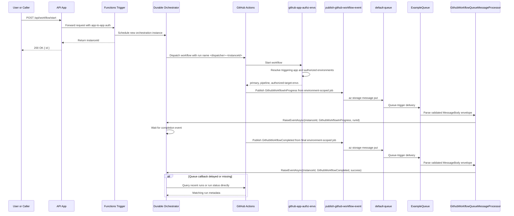

# Workflow Orchestration Setup

## Overview

This document describes the current queue-based orchestration design used by this repository.

The supported completion path is:

1. A caller starts an orchestration through the API or directly through the local Functions trigger.
2. The Functions app dispatches a GitHub Actions workflow whose run name is `<dispatcher>-<instanceId>`.
3. GitHub Actions publishes `GithubWorkflowInProgress` and `GithubWorkflowCompleted` messages to the dispatcher storage account's `default-queue`.
4. `ExampleQueue` remains the sole owner of `default-queue`, validates the outer `MessageBody` envelope, and forwards GitHub workflow messages into the dedicated workflow queue processor.
5. The workflow queue processor raises Durable external events for the target orchestration instance and suppresses duplicate side effects for repeated deliveries.
6. If a queue callback is delayed or missing, the orchestrator falls back to direct GitHub API polling.

Webhook delivery is no longer part of the supported runtime design. The API project is not a GitHub webhook receiver, and the GitHub App does not need a webhook URL or webhook secret for orchestration.

For GitHub App provisioning, see the [GitHub App Creation Guide](./github-app-creation.md).

---

## Architecture


```mermaid
sequenceDiagram
    participant User as User or Caller
    participant API as API App
    participant Trigger as Functions Trigger
    participant Orchestrator as Durable Orchestrator
    participant GitHub as GitHub Actions
    participant Authz as github-app-authz-envs
    participant Publish as publish-github-workflow-event
    participant Queue as default-queue
    participant ExampleQueue as ExampleQueue
    participant Processor as GithubWorkflowQueueMessageProcessor

    User->>API: POST /api/workflow/start
    API->>Trigger: Forward request with app-to-app auth
    Trigger->>Orchestrator: Schedule new orchestration instance
    Trigger-->>API: Return instanceId
    API-->>User: 200 OK { id }

    Orchestrator->>GitHub: Dispatch workflow with run name <dispatcher>-<instanceId>

    GitHub->>Authz: Start workflow
    Authz->>Authz: Resolve triggering app and authorized environments
    Authz-->>GitHub: primary, pipeline, authorized-target-envs

    GitHub->>Publish: Publish GithubWorkflowInProgress from environment-scoped job
    Publish->>Queue: az storage message put
    Queue->>ExampleQueue: Queue-trigger delivery
    ExampleQueue->>Processor: Parse validated MessageBody envelope
    Processor->>Orchestrator: RaiseEventAsync(instanceId, GithubWorkflowInProgress, runId)

    Orchestrator->>Orchestrator: Wait for completion event

    GitHub->>Publish: Publish GithubWorkflowCompleted from final environment-scoped job
    Publish->>Queue: az storage message put
    Queue->>ExampleQueue: Queue-trigger delivery
    ExampleQueue->>Processor: Parse validated MessageBody envelope
    Processor->>Orchestrator: RaiseEventAsync(instanceId, GithubWorkflowCompleted, success)

    alt Queue callback delayed or missing
        Orchestrator->>GitHub: Query recent runs or run status directly
        GitHub-->>Orchestrator: Matching run metadata
    end
```

---

## Key flow points

1. The orchestration correlation key is always the Durable `instanceId` encoded into `workflowName`.
2. The workflow run name format is `<dispatcher>-<instanceId>`. The current dispatcher emitted by the Functions app is `InternalApi`.
3. `github-app-authz-envs` is authz-only. It does not perform Azure login or queue publication.
4. `GithubWorkflowInProgress` and `GithubWorkflowCompleted` are published by separate environment-scoped jobs that declare the target GitHub environment so Azure OIDC emits the correct `repo:<owner>/<repo>:environment:<env>` subject.
5. `publish-github-workflow-event` is the shared publisher for both message types.
6. The publisher base64-encodes the outer `MessageBody` JSON before calling `az storage message put` because the Functions app keeps the default Azure Storage Queues trigger semantics.
7. `ExampleQueue` remains the sole queue trigger on `default-queue` and the outer envelope-validation boundary.
8. Duplicate side effects are prevented by correlating on `instanceId`, `runId`, `runAttempt`, and message type.

---

## Prerequisites

Before using workflow orchestration, make sure all of the following are true:

1. The GitHub App for the target environment exists, is installed on the repository, and its private key has been uploaded to the environment Key Vault. See [GitHub App Creation Guide](./github-app-creation.md).
2. The Functions app has valid `Github` configuration values for owner, repo, branch, app id, installation id, private key, retry schedule, and workflow timeout.
3. The GitHub Actions service principal for each target environment can authenticate to Azure through OIDC.
4. The dispatcher storage account grants that service principal the built-in `Storage Queue Data Message Sender` role so the workflow can publish to `default-queue` with `--auth-mode login`.

For application deployment workflows, the repository resolves the Git branch setting by preferring `github.head_ref` for pull-request-originated runs and falling back to `github.ref_name` for branch and manual runs.

---

## GitHub App Requirements

The GitHub App used for orchestration is now an Actions-authentication app, not a webhook delivery app.

Required repository permissions:

| Permission | Access |
| --- | --- |
| Actions | Read & Write |
| Metadata | Read |

Operational rules:

1. Install the app on `christianacca/web-api-starter`.
2. Generate and store the private key securely.
3. Configure the app id and installation id in the repo conventions and app settings.
4. Do not configure a webhook URL for orchestration callbacks.
5. Do not create or manage a webhook secret for orchestration.
6. Leave event subscription settings unused for this orchestration flow.

---

## Application Configuration

Both the API and Functions projects share the `Github` credential configuration section. The Functions project additionally reads the `GithubWorkflow` section for workflow-specific settings.
```json
{
  "Github": {
    "AppId": null,
    "InstallationId": 0,
    "PrivateKeyPem": null
  },
  "GithubWorkflow": {
    "Owner": null,
    "Repo": null,
    "Branch": null,
    "MaxAttempts": 5,
    "RerunTriggerRetryDelays": ["00:00:15", "00:00:30", "00:01:00"],
    "WorkflowTimeoutHours": 12
  }
}
```

`RerunTriggerRetryDelays` controls how long the Functions app waits before asking GitHub to rerun a failed workflow attempt.

For local queue verification, the Functions app may also read this optional user-secret-backed setting:

```json
{
  "GithubWorkflow": {
    "LocalVerification": {
      "QueueEndpoint": "https://<your-dev-tunnel-host>/devstoreaccount1"
    }
  }
}
```

This setting is development-only. It allows the Functions dispatcher to send a `localVerification` workflow input so GitHub Actions can publish back into local Azurite through a public queue endpoint.

For tunnel setup, see [Microsoft dev tunnels for local services](./dev-tunnels.md).

---

## Workflow Requirements

### Required trigger and run name

The workflow must support `workflow_dispatch` with a `workflowName` input, and the workflow run name must use that same value.

```yaml
on:
  workflow_dispatch:
    inputs:
      workflowName:
        description: Dispatcher-prefixed workflow name in the form <dispatcher>-<instanceId>
        required: true
        type: string
      localVerification:
        description: Optional local-only queue publication override JSON supplied by the local Functions dispatcher
        required: false
        type: string

run-name: ${{ inputs.workflowName }}
```

### Required workflow shape

The implemented job pattern is:

1. `github-app-authz` runs first and calls `github-app-authz-envs` with a multi-line `gated-environments` input.
2. `publish-inprogress` runs in the resolved primary GitHub environment, obtains an OIDC token for that environment, and publishes `GithubWorkflowInProgress` with `publish-github-workflow-event`.
3. The environment jobs run only when their environment appears in `authorized-target-envs`.
4. `publish-completed` runs with `if: always()` and publishes `GithubWorkflowCompleted` only after the bootstrap publisher succeeded.

Minimal queue-aware example:

```yaml
name: Orchestrator Test Workflow

on:
  workflow_dispatch:
    inputs:
      workflowName:
        description: Dispatcher-prefixed workflow name in the form <dispatcher>-<instanceId>
        required: true
        type: string
      localVerification:
        description: Optional local-only queue publication override JSON supplied by the local Functions dispatcher
        required: false
        type: string

run-name: ${{ inputs.workflowName }}

permissions:
  contents: read

jobs:
  github-app-authz:
    runs-on: ubuntu-latest
    outputs:
      authz-primary-env: ${{ steps.authz.outputs.primary }}
      authz-authorized-target-envs: ${{ steps.authz.outputs.authorized-target-envs }}
    steps:
      - uses: actions/checkout@v4
      - id: authz
        uses: ./.github/actions/github-app-authz-envs
        with:
          gated-environments: |
            dev

  publish-inprogress:
    runs-on: ubuntu-latest
    needs: github-app-authz
    environment:
      name: ${{ needs.github-app-authz.outputs.authz-primary-env }}
    permissions:
      contents: read
      id-token: write
    outputs:
      published-in-progress: ${{ steps.publish.outputs.published }}
      authz-primary-env: ${{ needs.github-app-authz.outputs.authz-primary-env }}
      authz-authorized-target-envs: ${{ needs.github-app-authz.outputs.authz-authorized-target-envs }}
    steps:
      - uses: actions/checkout@v4
      - id: publish
        uses: ./.github/actions/publish-github-workflow-event
        with:
          github-environment: ${{ needs.github-app-authz.outputs.authz-primary-env }}
          message-type: GithubWorkflowInProgress
          local-verification: ${{ inputs.localVerification }}
          repository: ${{ github.repository }}
          run-attempt: ${{ github.run_attempt }}
          run-id: ${{ github.run_id }}
          workflow-name: ${{ inputs.workflowName }}

  dev-task:
    runs-on: ubuntu-latest
    needs: publish-inprogress
    if: contains(fromJSON(needs.publish-inprogress.outputs.authz-authorized-target-envs), 'dev')
    environment:
      name: dev
    steps:
      - uses: actions/checkout@v4
      - run: echo "Run the dev job"

  publish-completed:
    runs-on: ubuntu-latest
    needs:
      - publish-inprogress
      - dev-task
    if: ${{ always() && needs.publish-inprogress.outputs.published-in-progress == 'true' }}
    environment:
      name: ${{ needs.publish-inprogress.outputs.authz-primary-env }}
    permissions:
      contents: read
      id-token: write
    steps:
      - uses: actions/checkout@v4
      - uses: ./.github/actions/publish-github-workflow-event
        with:
          github-environment: ${{ needs.publish-inprogress.outputs.authz-primary-env }}
          message-type: GithubWorkflowCompleted
          local-verification: ${{ inputs.localVerification }}
          needs-json: ${{ toJSON(needs) }}
          repository: ${{ github.repository }}
          run-attempt: ${{ github.run_attempt }}
          run-id: ${{ github.run_id }}
          workflow-name: ${{ inputs.workflowName }}
```

---

## Supporting Both Human and Bot Dispatch

By default, `github-app-authz`, `publish-inprogress`, and `publish-completed` are bot-only jobs — they authorize the dispatching GitHub App and publish queue messages. A workflow that also needs to support human-triggered dispatch must explicitly detect the dispatch mode and condition each job accordingly.

### Detection mechanism

Use `github.triggering_actor` as the dispatch-mode signal:

- **Bot dispatch**: `endsWith(github.triggering_actor, '[bot]')` evaluates to `true`
- **Human dispatch**: the expression evaluates to `false`

GitHub sets `triggering_actor` — it cannot be forged via workflow inputs. Using an input such as `workflowName != ''` as the detection signal would be insecure: a bot could deliberately omit `workflowName` and bypass `github-app-authz`.

### Pattern 1 — Bot-only guard

Apply this condition to jobs that must only run for bot dispatch (for example, `github-app-authz`):

```yaml
if: endsWith(github.triggering_actor, '[bot]')
```

### Pattern 2 — Dual-condition for environment jobs

Apply this pattern to environment jobs that must run for both dispatch modes:

```yaml
if: |
  always() && !cancelled() &&
  (
    !endsWith(github.triggering_actor, '[bot]') ||
    (needs.publish-inprogress.result == 'success' &&
     contains(fromJSON(needs.publish-inprogress.outputs.authz-authorized-target-envs), '<env>'))
  )
```

Replace `<env>` with the target environment name (for example, `dev` or `qa`). The `always() && !cancelled()` clauses ensure the job runs even when its `needs` are skipped on the human path.

### Making `workflowName` optional

When supporting human dispatch, make the `workflowName` input optional and update `run-name` to handle the empty case:

```yaml
run-name: "${{ inputs.workflowName != '' && inputs.workflowName || format('manual: {0}', github.actor) }}"
```

> **YAML quoting requirement**: Wrap `run-name` in double quotes when the expression contains `': '` (colon-space). Without the surrounding quotes, YAML treats the colon-space in `'manual: '` as a mapping separator and the workflow file fails to parse.

### Shared actions are not modified

`github-app-authz-envs` and `publish-github-workflow-event` work unchanged for both dispatch modes. No changes to those actions are needed.

### Reference implementation

`.github/workflows/github-integration-test.yml` is the canonical dual-dispatch reference for this repository. Its inline comments document each job's expected outcome for all three dispatch scenarios (bot authorized for dev only, bot authorized for dev+qa, and human dispatch). For human dispatch E2E verification, see [Human Dispatch Simulation](#human-dispatch-simulation).

---

## Authorization Contract

### `github-app-authz-envs`

The action [../.github/actions/github-app-authz-envs/action.yml](../.github/actions/github-app-authz-envs/action.yml) is the fail-closed authorization step for queue-aware workflows.

Input contract (example):

```yaml
with:
  gated-environments: |
    dev
    qa
```

Output contract:

1. `primary`: the primary environment for the dispatching GitHub App.
2. `pipeline`: the full authorized pipeline environment list as JSON.
3. `authorized-target-envs`: the ordered intersection between `gated-environments` and the app-authorized pipeline environments, serialized as a JSON array for downstream `if` expressions.

Behavior:

1. Resolve the dispatching GitHub App from `github.triggering_actor`.
2. Fail the workflow if the actor cannot be resolved to a supported GitHub App.
3. Intersect the workflow's gated environments with that app's authorized pipeline environments.
4. Fail the workflow if the intersection is empty.
5. Leave Azure login and queue publication to the later environment-scoped jobs.

---

## Queue Publication Contract

### `publish-github-workflow-event`

The action [../.github/actions/publish-github-workflow-event/action.yml](../.github/actions/publish-github-workflow-event/action.yml) is the shared queue publisher for both workflow event types.

Key inputs:

1. `github-environment`: the primary GitHub environment used for Azure login and conventions lookup.
2. `message-type`: `GithubWorkflowInProgress` or `GithubWorkflowCompleted`.
3. `workflow-name`: the dispatcher-prefixed run name.
4. `repository`, `run-id`, and `run-attempt`: correlation fields.
5. `needs-json`: required only for `GithubWorkflowCompleted` so the action can derive the conclusion.
6. `local-verification`: optional local-only override JSON.

Behavior:

1. When `local-verification` is empty, the action logs into Azure with the environment-scoped OIDC subject and publishes with `az storage message put --auth-mode login`.
2. The queue publisher resolves the dispatcher and storage account from `workflowName`, not from a hard-coded app name.
3. When `local-verification` is present, the action bypasses storage-account lookup for transport only and publishes with `--connection-string` against the public Azurite queue endpoint.
4. The action constructs the workflow payload, wraps it in the shared `MessageBody` envelope, base64-encodes the outer JSON, and passes the encoded string to `az storage message put --content`.
5. The steady-state Azure path uses the built-in `Storage Queue Data Message Sender` role. It does not fall back to shared keys, connection strings, or SAS.

### Queue transport format

The payload written to the queue is a base64-encoded UTF-8 string whose decoded JSON matches this shape:

```json
{
  "id": "5f9fe4dc-7e74-4f51-9fdc-9dfc8a4cfd6e",
  "data": "{\"environment\":\"dev\",\"instanceId\":\"42cf976321bd4288a18a3dc54e3e6228\",\"repository\":\"christianacca/web-api-starter\",\"runAttempt\":1,\"runId\":23686425734,\"workflowName\":\"InternalApi-42cf976321bd4288a18a3dc54e3e6228\"}",
  "metadata": {
    "messageType": "GithubWorkflowInProgress"
  }
}
```

Important transport rules:

1. `MessageBody.Data` is a JSON string, not a nested object.
2. The publisher serializes the inner payload once into `data`.
3. The publisher serializes the outer envelope once.
4. The publisher base64-encodes the outer envelope before queue submission.
5. `ExampleQueue` is the only consumer bound to `default-queue`.

### Supported workflow payloads

`GithubWorkflowInProgress` minimum payload:

```json
{
  "environment": "dev",
  "instanceId": "42cf976321bd4288a18a3dc54e3e6228",
  "repository": "christianacca/web-api-starter",
  "runAttempt": 1,
  "runId": 23686425734,
  "workflowName": "InternalApi-42cf976321bd4288a18a3dc54e3e6228"
}
```

`GithubWorkflowCompleted` minimum payload:

```json
{
  "conclusion": "success",
  "environment": "dev",
  "instanceId": "42cf976321bd4288a18a3dc54e3e6228",
  "repository": "christianacca/web-api-starter",
  "runAttempt": 1,
  "runId": 23686425734,
  "workflowName": "InternalApi-42cf976321bd4288a18a3dc54e3e6228"
}
```

`messageType` carries lifecycle state. The inner payload does not duplicate a `status` field.

---

## Queue Consumption and Duplicate Handling

The Functions-side queue design is intentionally split:

1. `ExampleQueue` validates the outer queue envelope and remains the only `default-queue` trigger.
2. `GithubWorkflowQueueMessageProcessor` handles GitHub workflow message parsing, correlation, dedupe, and Durable event raising.

Duplicate handling contract:

1. The minimum dedupe tuple is `instanceId`, `runId`, `runAttempt`, and `messageType`.
2. The processor reserves that tuple in the workflow message state table before raising the Durable event.
3. Repeated deliveries with the same tuple do not create duplicate Durable side effects.
4. Invalid or unsupported workflow queue messages still retry under normal queue semantics.
5. On the final attempt, workflow-message failures are logged inline after dedupe-state cleanup rather than being moved to `default-queue-poison`.

---

## Retry Behavior and Fallback Polling

The orchestrator still supports retries and fallback polling.

### Event and polling behavior

1. The orchestrator waits first for `GithubWorkflowInProgress` and then for `GithubWorkflowCompleted`.
2. If the in-progress message does not arrive before timeout, the orchestrator queries GitHub for a matching recent workflow run.
3. If the completed message does not arrive before timeout, the orchestrator queries GitHub for the workflow run status directly.

### `RerunEntireWorkflow`

Default behavior retries failed jobs only.

```json
{
  "WorkflowFile": "deploy.yaml"
}
```

Use `RerunEntireWorkflow: true` when retrying workflows that depend on environment approvals or on earlier jobs that must rerun with the failing jobs.

```json
{
  "WorkflowFile": "deploy.yaml",
  "RerunEntireWorkflow": true
}
```

This remains the correct choice for workflows that use a separate environment auto-approval job, because rerunning only failed jobs would otherwise skip the approval job that the later environment job depends on.

---

## Monitoring and troubleshooting

Use [Durable Function Monitoring](./durable-function-monitoring.md) for local Durable inspection.

If the queue callback does not arrive:

1. Confirm the workflow run name includes the expected dispatcher prefix and instance id.
2. Confirm the relevant GitHub environment job obtained an OIDC token and executed the publisher action.
3. Confirm the target queue publisher resolved the expected storage account for the dispatcher prefix.
4. Confirm the queued message still contains a valid outer `MessageBody` envelope.
5. Confirm `ExampleQueue` logs show the message being validated and forwarded to `GithubWorkflowQueueMessageProcessor`.
6. If the queue event never arrives, inspect orchestrator fallback polling behavior in the Functions logs.

---

## Triggering and operational verification

### Trigger a workflow through the deployed API

Use the Postman collection in `tests/postman/api.postman_collection.json` (Proxied>Trigger Workflow) or call the supported API route directly.

Example request body:

```json
{
  "WorkflowFile": "github-integration-test.yml",
  "RerunEntireWorkflow": true
}
```

Expected response:

```json
{
  "Id": "instanceId"
}
```

### Recommended deployed verification flow

When validating a deployed environment, use this sequence:

1. Trigger the orchestration through the supported API path.
2. Capture the returned `instanceId`.
3. Locate the matching GitHub Actions run whose run name is `InternalApi-<instanceId>`.
4. Use Application Insights or Azure Monitor logs to confirm:
   - the workflow trigger ran for that instance
   - queue-driven `RaiseEvent:GithubWorkflowInProgress` occurred
   - queue-driven `RaiseEvent:GithubWorkflowCompleted` occurred
   - the durable orchestration reached its expected terminal state

### Local verification

For local end-to-end queue verification:

1. Start the Functions app locally.
2. Start Azurite.
3. Expose the Azurite queue endpoint through a dev tunnel as described in [Microsoft dev tunnels for local services](./dev-tunnels.md).
4. Set `Github:LocalVerification:QueueEndpoint` in user secrets to the tunneled queue base URL.
5. Dispatch the queue-aware GitHub workflow and verify that `GithubWorkflowInProgress` and `GithubWorkflowCompleted` arrive on local `default-queue`.

For the full step-by-step terminal procedure, see [Exact Local E2E Validation Procedure](#exact-local-e2e-validation-procedure).

---

## Exact Local E2E Validation Procedure

Use this procedure to validate the queue-callback path end to end from a local machine. This procedure is intentionally terminal-first and is written so that either a human or a coding agent can run it step by step without needing to infer missing commands.

This procedure validates the following path:

1. local Functions receives `POST /api/workflow/start` on `GithubWorkflowTrigger`
2. local Functions dispatches the target GitHub Actions workflow on the configured branch
3. GitHub Actions publishes `GithubWorkflowInProgress` and `GithubWorkflowCompleted` back through the `localVerification` seam
4. the messages arrive in local Azurite through the dev tunnel queue endpoint
5. the local Durable orchestration reaches the expected terminal state for the returned `instanceId`

### Validation prerequisites

Before running the commands below, make sure all of the following are true:

1. You have already completed the local setup in [Local dev setup](./dev-setup.md) for the Functions app, Azurite, and Azure login.
2. The branch you currently have checked out locally has been pushed to GitHub.
3. If you want GitHub Actions to execute `master`, check out `master` locally before running the procedure.
4. You have GitHub CLI installed and authenticated.

If GitHub CLI is not installed, install it first:

```pwsh
brew install gh
gh auth login
```

### Terminal conventions

Run the commands below from the repository root.

The command blocks are written for PowerShell and are intended to be pasted directly into a PowerShell terminal.

If your active terminal is not PowerShell, open a PowerShell terminal first. Only use `pwsh -File` for checked-in `.ps1` scripts.

To keep GitHub CLI output non-interactive during this procedure, disable paging in Terminal D before you run any `gh` commands:

```pwsh
$env:GH_PAGER = 'cat'
```

Use four terminals:

1. Terminal A: Azurite
2. Terminal B: dev tunnel host
3. Terminal C: Functions app
4. Terminal D: validation commands

### Step 1: Set validation variables

In Terminal D, set the variables for the run you want to validate.

Replace the placeholder values before running the block.

`$WorkflowBranch` is derived from the branch currently checked out in your local git working tree so that the validation uses the same branch without requiring any manual branch selection.

`$TunnelId` is the id of the persistent dev tunnel you already created for yourself by following [Microsoft dev tunnels for local services](./dev-tunnels.md). Use that existing tunnel id here.

```pwsh
$WorkflowBranch = (git rev-parse --abbrev-ref HEAD).Trim()
$TunnelId = '<your-dev-tunnel-id>'
$QueueTunnelBaseUrl = 'https://<your-dev-tunnel-host>/devstoreaccount1'
$WorkflowFile = 'github-integration-test.yml'
$FunctionsBaseUrl = 'http://localhost:7071'
$RepoRoot = (Get-Location).Path
$TmpDir = Join-Path $RepoRoot 'tmp'
$FunctionsLog = Join-Path $TmpDir 'local-workflow-functions.log'
$DurableInstancesLog = Join-Path $TmpDir 'local-workflow-durable-instances.json'
$DurableHistoryLog = Join-Path $TmpDir 'local-workflow-durable-history.json'
$RunListLog = Join-Path $TmpDir 'local-workflow-gh-run-list.json'
$RunLog = Join-Path $TmpDir 'local-workflow-gh-run.json'

if ([string]::IsNullOrWhiteSpace($WorkflowBranch)) {
  throw 'Failed to determine the current git branch.'
}

New-Item -ItemType Directory -Path $TmpDir -Force | Out-Null
Remove-Item $FunctionsLog, $DurableInstancesLog, $DurableHistoryLog, $RunListLog, $RunLog -Force -ErrorAction SilentlyContinue

Write-Host "WorkflowBranch: $WorkflowBranch"
```

Keep the first non-empty `instanceId` returned by Step 7 as the validation target unless Step 7 itself fails before returning an id.

### Step 2: Restore tools and sign in

In Terminal D, run:

```pwsh
az login --tenant <your-tenant-id> --allow-no-subscriptions
dotnet restore --interactive
dotnet tool restore
devtunnel user login
gh auth status
```

### Step 3: Apply the local validation overrides

In Terminal D, run:

```pwsh
dotnet user-secrets set GithubWorkflow:Branch $WorkflowBranch --project ./src/Template.Functions/Template.Functions.csproj
dotnet user-secrets set GithubWorkflow:LocalVerification:QueueEndpoint $QueueTunnelBaseUrl --project ./src/Template.Functions/Template.Functions.csproj
```

If you need to validate a specific rerun schedule locally without editing code, set the indexed `GithubWorkflow:RerunTriggerRetryDelays` values through user-secrets before starting the Functions host. For example, a single 1ms retry is:

```pwsh
dotnet user-secrets set GithubWorkflow:RerunTriggerRetryDelays:0 00:00:00.001 --project ./src/Template.Functions/Template.Functions.csproj
dotnet user-secrets remove GithubWorkflow:RerunTriggerRetryDelays:1 --project ./src/Template.Functions/Template.Functions.csproj
dotnet user-secrets remove GithubWorkflow:RerunTriggerRetryDelays:2 --project ./src/Template.Functions/Template.Functions.csproj
```

### Step 4: Start Azurite

In Terminal A, run:

```pwsh
./tools/azurite/azurite-run.ps1
```

If Terminal A is not a PowerShell session, run:

```text
pwsh -File ./tools/azurite/azurite-run.ps1
```

Leave Terminal A running.

### Step 5: Start the dev tunnel host

In Terminal B, run:

```pwsh
$TunnelId = '<your-dev-tunnel-id>'
devtunnel host $TunnelId
```

Use the same tunnel id value that you assigned to `$TunnelId` in Terminal D.

Leave Terminal B running.

In Terminal D, confirm that the queue port is actively hosted:

```pwsh
devtunnel show $TunnelId
```

The output must show `Host connections: 1` or higher before continuing. Do not use `devtunnel port show` to verify this — that command reports `Client connections` (currently active external callers), which will always be `0` outside of an active request and does not confirm the tunnel host is running.

### Step 6: Start the local Functions app

In Terminal C, run:

```pwsh
dotnet build ./src/Template.Functions/Template.Functions.csproj
Set-Location ./src/Template.Functions/bin/Debug/net10.0
func start *>&1 | Tee-Object -FilePath $FunctionsLog
```

Leave Terminal C running.

In Terminal D, confirm the Functions app is healthy:

```pwsh
Invoke-RestMethod -Method Get -Uri "$FunctionsBaseUrl/api/Echo"
```

Do not proceed to Step 7 until the Echo endpoint returns successfully and Terminal C shows the Functions host has started.

> **Important — idle restart**: If the Functions app was already running from a previous session and has been idle for an extended period, restart it before continuing. A long-idle host can silently fail at `TriggerWorkflowActivity` with a disposed RSA key error (`Cannot access a disposed object — RSAImplementation`), causing Step 8 to fail because no GitHub Actions run is ever dispatched. To restart, stop Terminal C (`Ctrl+C`), then rerun the `func start` command above.

### Step 7: Trigger the workflow directly through `GithubWorkflowTrigger`

In Terminal D, run:

```pwsh
$TriggerResponse = Invoke-RestMethod -Method Post -Uri "$FunctionsBaseUrl/api/workflow/start" -ContentType 'application/json' -Body (@{
  WorkflowFile = $WorkflowFile
  RerunEntireWorkflow = $true
} | ConvertTo-Json)

$InstanceId = $TriggerResponse.Id
if ([string]::IsNullOrWhiteSpace($InstanceId)) {
  throw 'Workflow start did not return an instance id.'
}

$WorkflowName = "InternalApi-$InstanceId"

Write-Host "InstanceId: $InstanceId"
Write-Host "WorkflowName: $WorkflowName"
```

### Step 8: Locate the matching GitHub Actions run on the target branch

In Terminal D, run:

```pwsh
$Run = $null
foreach ($i in 1..24) {
  Start-Sleep -Seconds 10
  $RunCandidates = gh run list --workflow $WorkflowFile --branch $WorkflowBranch --limit 100 --json databaseId,displayTitle,status,conclusion,attempt,url,workflowName,createdAt |
    Tee-Object -FilePath $RunListLog |
    ConvertFrom-Json

  $Run = $RunCandidates |
    Where-Object { $_.displayTitle -eq $WorkflowName } |
    Sort-Object createdAt -Descending |
    Select-Object -First 1

  if ($Run) { break }
}

if (-not $Run) {
  throw "Failed to find GitHub Actions run for workflow name '$WorkflowName' on branch '$WorkflowBranch'."
}

$Run | Select-Object databaseId, displayTitle, status, conclusion, attempt, url, createdAt | Format-List
```

### Step 9: Wait for the GitHub Actions run to complete

In Terminal D, run:

```pwsh
foreach ($i in 1..60) {
  Start-Sleep -Seconds 10
  $Run = gh run view $Run.databaseId --json databaseId,attempt,status,conclusion,url,displayTitle |
    Tee-Object -FilePath $RunLog |
    ConvertFrom-Json

  Write-Host "Run status: $($Run.status); conclusion: $($Run.conclusion); attempt: $($Run.attempt)"
  if ($Run.status -eq 'completed') { break }
}

if ($Run.status -ne 'completed') {
  throw "GitHub Actions run $($Run.databaseId) did not complete within the expected time window."
}
```

### Step 10: Inspect the local Functions log for queue-message evidence

In Terminal D, run:

```pwsh
Select-String -Path $FunctionsLog -Pattern $InstanceId, $WorkflowName, 'GithubWorkflowInProgress', 'GithubWorkflowCompleted' |
  Select-Object LineNumber, Line
```

Expected evidence:

1. the orchestration instance id appears in the log
2. `GithubWorkflowInProgress` appears in the log, for example in a durable-host line such as `Reason: RaiseEvent:GithubWorkflowInProgress`
3. `GithubWorkflowCompleted` appears in the log, for example in a durable-host line such as `Reason: RaiseEvent:GithubWorkflowCompleted`

### Step 11: Inspect Durable state in Azurite

In Terminal D, run:

```pwsh
$LocalSettings = Get-Content ./src/Template.Functions/local.settings.json -Raw | ConvertFrom-Json
$StorageConnectionString = $LocalSettings.Values.AzureWebJobsStorage

$env:AZURE_CLI_DISABLE_CONNECTION_VERIFICATION = '1'

$InstancesJson = az storage entity query --table-name TestHubNameInstances --connection-string "$StorageConnectionString" --filter "PartitionKey eq '$InstanceId'" --only-show-errors -o json
$HistoryJson = az storage entity query --table-name TestHubNameHistory --connection-string "$StorageConnectionString" --filter "PartitionKey eq '$InstanceId'" --only-show-errors -o json

$InstancesJson | Set-Content $DurableInstancesLog
$HistoryJson | Set-Content $DurableHistoryLog

Get-Content $DurableInstancesLog
Get-Content $DurableHistoryLog
```

Some Azure CLI versions do not accept `--accept application/json` on `az storage entity query`. The `-o json` form above is the compatibility baseline for this runbook.

Expected evidence:

1. `TestHubNameInstances` returns an entity for the returned `instanceId`
2. `TestHubNameHistory` returns one or more rows for that same `instanceId`
3. the instance record shows a terminal orchestration state consistent with the GitHub workflow conclusion

### Step 12: Optional direct queue verification

If you need to prove the Azure CLI can publish through the public Azurite queue endpoint used by the seam, run this in Terminal D:

```pwsh
$LocalSettings = Get-Content ./src/Template.Functions/local.settings.json -Raw | ConvertFrom-Json
$LocalStorageConnectionString = $LocalSettings.Values.AzureWebJobsStorage

if ([string]::IsNullOrWhiteSpace($LocalStorageConnectionString)) {
  throw 'AzureWebJobsStorage was not found in ./src/Template.Functions/local.settings.json.'
}

$ValidationConnectionString = ($LocalStorageConnectionString -replace 'QueueEndpoint=[^;]+', "QueueEndpoint=$QueueTunnelBaseUrl")

az storage queue create --name local-validation --connection-string "$ValidationConnectionString" --only-show-errors
az storage message put --queue-name local-validation --connection-string "$ValidationConnectionString" --content '{"validation":"local-e2e"}' --only-show-errors
```

This command is part of seam validation through the public tunnel endpoint. It is distinct from direct local CLI diagnostics against `https://127.0.0.1`, which may require `AZURE_CLI_DISABLE_CONNECTION_VERIFICATION=1`.

### Pass criteria

Treat the validation as passed only when all of the following are true:

1. the Functions health check succeeds
2. the dev tunnel shows an active host connection for port `10001`
3. `POST /api/workflow/start` on the local Functions host returns a non-empty `instanceId`
4. a GitHub Actions run exists on the target branch with `displayTitle` equal to `InternalApi-<instanceId>`
5. that GitHub Actions run reaches `completed`
6. the Functions log contains evidence for both `GithubWorkflowInProgress` and `GithubWorkflowCompleted` for the target instance
7. Azurite Durable state exists for the same `instanceId` in both `TestHubNameInstances` and `TestHubNameHistory`
8. the terminal Durable state is consistent with the GitHub Actions run conclusion

### Failure handling

If the validation fails, collect and keep these files for diagnosis:

1. `tmp/local-workflow-functions.log`
2. `tmp/local-workflow-durable-instances.json`
3. `tmp/local-workflow-durable-history.json`

Record the failing command, the returned `instanceId`, the computed `workflowName`, the GitHub Actions run id, and whether the tunnel showed an active host connection when the failure occurred.

---

## Human Dispatch Simulation

Use this procedure to verify that, for a human-triggered run of `github-integration-test.yml`, all bot-only jobs are skipped and environment jobs run without any queue interaction.

> **Scope**: This procedure is specific to `github-integration-test.yml`. It is not a generic human-dispatch verification template.

**No infrastructure required.** No dev tunnel, no Azurite, and no local Functions app are needed.

### Step 1: Push the branch and set variables

```pwsh
git push

$WorkflowBranch = (git rev-parse --abbrev-ref HEAD).Trim()
$WorkflowFile = 'github-integration-test.yml'
$env:GH_PAGER = 'cat'
```

### Step 2: Dispatch as human (no inputs)

```pwsh
gh workflow run $WorkflowFile --ref $WorkflowBranch
```

### Step 3: Locate the most recent run

Wait approximately 15 seconds, then run:

```pwsh
$HumanRuns = gh run list --workflow $WorkflowFile --branch $WorkflowBranch --limit 5 --json databaseId,displayTitle,status,conclusion,createdAt | ConvertFrom-Json
$LatestRun = $HumanRuns | Sort-Object createdAt -Descending | Select-Object -First 1
$LatestRun | Select-Object databaseId, displayTitle, status, conclusion | Format-List
```

Confirm the run name matches `manual: <actor>` (not `InternalApi-...`).

### Step 4: Approve the `qa` environment gate

`qa-task` is blocked at the GitHub environment protection rule and requires a human reviewer to approve. Run:

```pwsh
$QaEnvId = (gh api "repos/christianacca/web-api-starter/environments" | ConvertFrom-Json).environments |
    Where-Object { $_.name -eq 'qa' } | Select-Object -ExpandProperty id

gh api "repos/christianacca/web-api-starter/actions/runs/$($LatestRun.databaseId)/pending_deployments" `
    --method POST -F "environment_ids[]=$QaEnvId" -f state=approved -f comment="Human dispatch verification"
```

### Step 5: Wait for the run to complete

```pwsh
foreach ($i in 1..60) {
  Start-Sleep -Seconds 10
  $RunStatus = gh run view $LatestRun.databaseId --json status,conclusion | ConvertFrom-Json
  Write-Host "status: $($RunStatus.status); conclusion: $($RunStatus.conclusion)"
  if ($RunStatus.status -eq 'completed') { break }
}
```

### Step 6: Verify per-job results

```pwsh
gh run view $LatestRun.databaseId --json jobs | ConvertFrom-Json |
    Select-Object -ExpandProperty jobs | Select-Object name, status, conclusion | Format-Table
```

### Pass criteria

Treat the simulation as passed when all of the following are true:

| Job | Expected result |
| --- | --- |
| `github-app-authz` | `skipped` |
| `publish-inprogress` | `skipped` |
| `dev-task` | `success` |
| `qa-auto-approve` | `skipped` |
| `qa-task` | `success` (after approval in Step 4) |
| `publish-completed` | `skipped` |

Additional checks:

- run-name matches `manual: <actor>` (not `InternalApi-...`)
- no `GithubWorkflowInProgress` or `GithubWorkflowCompleted` queue messages were published
- no Durable orchestration instance was created for this run

---

## Security Considerations

### Critical security practices

Store private keys only in secure vaults such as Azure Key Vault. Never store them in source control, plain-text config files, or logs.

### Queue-path security model

1. GitHub API calls from the Functions app still use GitHub App credentials and installation tokens.
2. Workflow queue publication in Azure uses GitHub OIDC plus the environment-scoped Azure service principal.
3. Queue publication requires the built-in `Storage Queue Data Message Sender` role on the target storage account.
4. The workflow must declare the target GitHub environment on the publishing jobs so the OIDC subject matches the federated credential configured for that environment.
5. The local `localVerification` seam is development-only and exists only to redirect queue transport into local Azurite.
6. No inbound webhook secret, HMAC validation, or `/api/github/webhooks` endpoint is part of the supported orchestration runtime.

---

## Additional Resources

### GitHub documentation

1. [GitHub Apps Documentation](https://docs.github.com/en/apps)
2. [Authenticating with GitHub Apps](https://docs.github.com/en/apps/creating-github-apps/authenticating-with-a-github-app)
3. [Using environments for deployment](https://docs.github.com/en/actions/deployment/targeting-different-environments/using-environments-for-deployment)